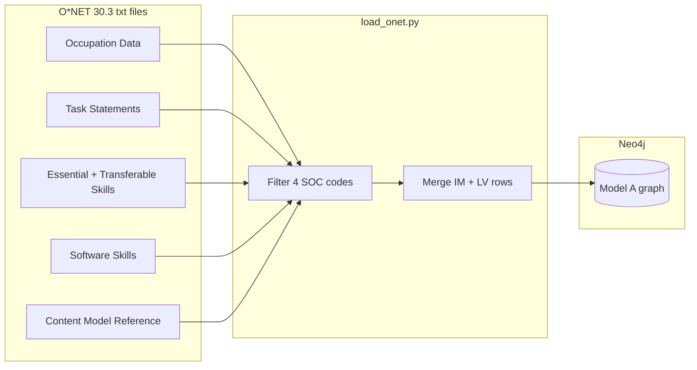
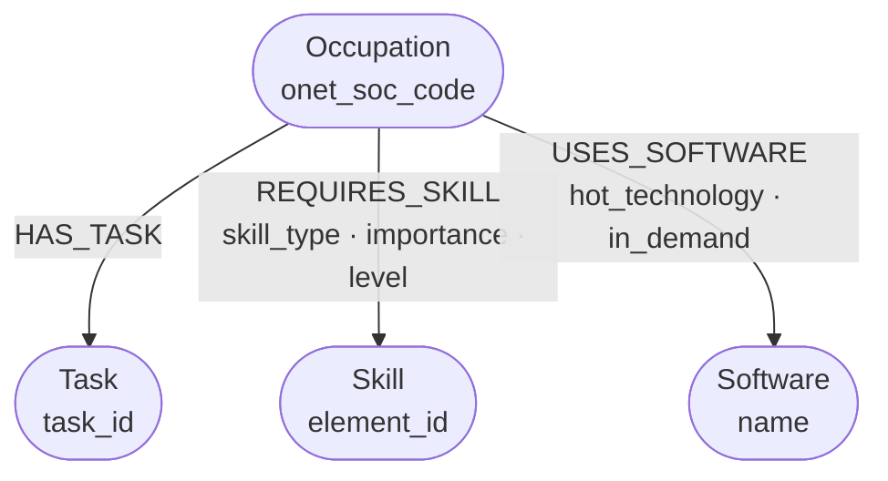
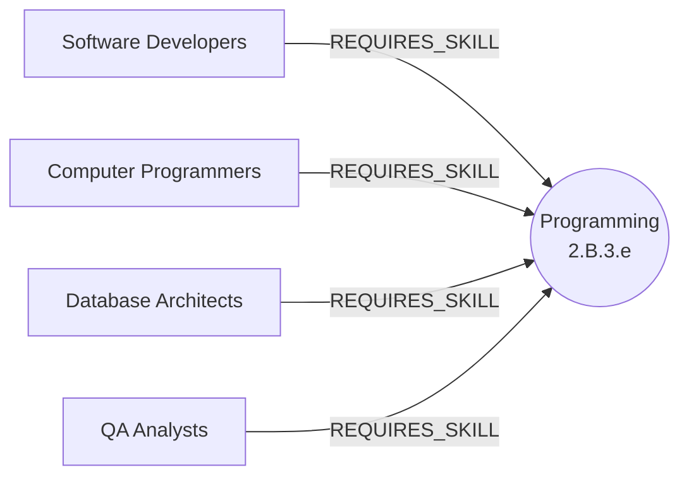
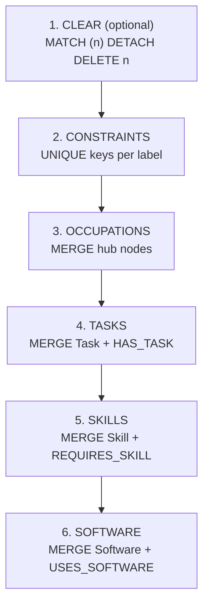
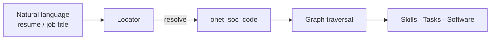
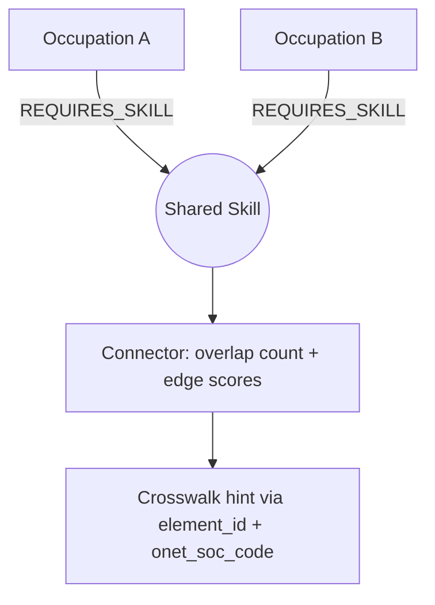

# Sprint 1 — O\*NET Knowledge Graph

**Author:** Aman Kumar Sarraf (LFX'26 · Talent Angels)  
**Taxonomy:** O\*NET 30.3 · **Graph DB:** Neo4j (AuraDB Free **or** local Docker)
**Sprint folder:** `mentees/AmanSarraf/sprint-01/`

---

## Which taxonomy

**O\*NET 30.3** (USDOL/ETA). I chose O\*NET over ESCO, SFIA, BLS, and Lightcast
for Sprint 1 because:

- It is a **relational taxonomy that is naturally graph-shaped** — occupations
  link to skills, tasks, and tools through stable keys (`O*NET-SOC Code`, `Element ID`).
- It is **US DOL–maintained**, openly licensed (CC BY 4.0), and updated quarterly.
- It maps directly to what **Locator** and **Connector** need: occupation resolution,
  skill overlap, and crosswalk anchors to other taxonomies.
- My week-1 research already anchored on **Software Developers (`15-1252.00`)**,
  so I could go deep on one domain rather than skim five taxonomies.

O\*NET is not CS-only — it covers ~1,016 occupations. I focused on a **software
cluster** (4 related occupations) for a coherent slice.

---

## Where the data comes from (+ license)

| Item | Detail |
|------|--------|
| **Release** | O\*NET 30.3 (May 2026) |
| **Download** | [db_30_3_text.zip](https://www.onetcenter.org/dl_files/database/db_30_3_text.zip) |
| **Database page** | https://www.onetcenter.org/database.html |
| **Dictionary** | https://www.onetcenter.org/dictionary/30.3/excel/ |
| **Browse (verify)** | https://www.onetonline.org/ |
| **License** | [CC BY 4.0](https://www.onetcenter.org/license_db.html) |

**Attribution** (per O\*NET license):

> This work includes information from the [O\*NET 30.3 Database](https://www.onetcenter.org/database.html)
> by the U.S. Department of Labor, Employment and Training Administration (USDOL/ETA).
> Used under the [CC BY 4.0](https://creativecommons.org/licenses/by/4.0/) license.
> O\*NET® is a trademark of USDOL/ETA.

**Local data:** extracted to `data/` (gitignored). Only links are committed.

**Files used in v1 (6 of 45):**

| File | Role |
|------|------|
| Occupation Data.txt | Occupation nodes |
| Task Statements.txt | Task nodes + HAS_TASK |
| Essential Skills.txt | Skill edges (foundational) |
| Transferable Skills.txt | Skill edges (technical, e.g. Programming) |
| Software Skills.txt | Software nodes + USES_SOFTWARE |
| Content Model Reference.txt | Skill descriptions |

### Why only 6 of 45 files?

O\*NET 30.3 ships **45 tab-delimited files** — join tables, reference lookups,
cross-domain linkages, and rated descriptors across the full Content Model. Loading
all of them on day one would mean parsing dozens of schemas before you have a
graph that answers a single question.

The sprint brief says: **a small, correct slice beats a huge mess.** So I picked the
**minimum set that completes Model A** — one hub node type (`:Occupation`) and three
question types Locator/Connector care about first:

| Question type | Example | File(s) that supply it |
|---------------|---------|------------------------|
| What is this job? | title, description, stable ID | Occupation Data |
| What does this job do? | task text | Task Statements |
| What skills does it need? | importance + level ratings | Essential + Transferable Skills |
| What tools does it use? | Python, AWS, JIRA | Software Skills |
| What does a skill ID mean? | Element ID → name + definition | Content Model Reference |

**Why these particular files (not others):**

1. **Occupation Data** — every O\*NET table joins on `O*NET-SOC Code`; without this
   hub you have edges but no anchor node for Locator to resolve to.
2. **Task Statements** — the exercise example is “occupations linked to their
   skills/**tasks**”; tasks are also matchable text for Locator (resume bullets).
3. **Essential Skills** — foundational skills (Critical Thinking, Reading, …). In
   30.3 these are a **separate file** from technical skills; you need both skill
   files for a complete picture of “what skills does role X require?”
4. **Transferable Skills** — where **Programming**, Systems Analysis, etc. live.
   Essential Skills alone gives only ~10 skills for Software Developers; skipping
   Transferable would make the graph look empty for a tech role.
5. **Software Skills** — tools are **not** in the skill files; Python/Git/AWS are
   their own rows. A separate `:Software` node type keeps “skill” vs “tool” clear
   (Connector crosswalks care about that distinction).
6. **Content Model Reference** — lookup only (not loaded as graph nodes). Enriches
   `:Skill` with human-readable descriptions from `Element ID` without building the
   full Content Model hierarchy (hundreds of group nodes — deferred to v2).

**What I deliberately skipped (for now):**

| Deferred file | Why wait |
|---------------|----------|
| Knowledge, Abilities, Work Activities | Same IM/LV pattern as skills — easy to add later, not needed for first queries |
| Related Occupations | Useful for Pathfinder/Connector v2 (`Occupation → Occupation` edges) |
| Job Titles, Sample of Reported Titles | Alternate names for Locator — planned next |
| Tasks → DWAs, *→ Work Context*, etc. | Cross-domain join tables; need more node types first |
| Scales Reference | Tiny IM/LV glossary — I learned the scales once, no loader dependency |

You still download the **full ZIP** locally (all 45 files land in `data/`), but the
loader only reads these six. To scale up: same schema, more files — no remodel.

**Source → graph (relational files become a graph you choose):**



---

## Graph model (Model A)

Four node labels, three relationship types. Occupation is the hub.



```
(:Occupation)-[:HAS_TASK]->(:Task)
(:Occupation)-[:REQUIRES_SKILL {skill_type, importance, level}]->(:Skill)
(:Occupation)-[:USES_SOFTWARE {hot_technology, in_demand}]->(:Software)
```

**Why shared skill nodes matter** — one `:Skill` node, many occupations, different edge scores:



| Node | Unique key | Example |
|------|------------|---------|
| `:Occupation` | `onet_soc_code` | `15-1252.00` |
| `:Task` | `task_id` | `21662` |
| `:Skill` | `element_id` | `2.B.3.e` (Programming) |
| `:Software` | `name` | Python |

**Node convention (project-wide):** every node also carries `source: "onet"`
and a `source_id` (the O\*NET-SOC code, Element ID, task ID, or software name).
This is the habit for the future integrated graph, so nodes from different
taxonomies can coexist without ID collisions.

### SOC crosswalk (bridge to BLS and ESCO)

The **O\*NET-SOC code's first 7 characters ARE the SOC code**:
`15-1252.00` → `15-1252`. That prefix is O\*NET's built-in bridge to **BLS**
(which publishes wages and projections by SOC) and, via the SOC ↔ ISCO
crosswalk, to **ESCO**. No lookup table needed — the mapping is derivable
in Cypher with `left(o.onet_soc_code, 7)`.

In [`graph.cypher`](graph.cypher) this is materialized as first-class edges:
each `:Occupation` has a `CROSSWALKS_TO` edge to a
`:CrosswalkCode {scheme: "SOC"}` node, so cross-taxonomy joins are graph
traversals rather than ETL merge logic. See Q12 in
[`queries.cypher`](queries.cypher).

**Slice occupations:**

| Code | Title |
|------|-------|
| `15-1252.00` | Software Developers |
| `15-1251.00` | Computer Programmers |
| `15-1243.00` | Database Architects |
| `15-1253.00` | Software Quality Assurance Analysts and Testers |

**Loaded size:** 758 nodes · 1,703 relationships.

---

## Deliverables in this folder

| File | What it is |
|------|------------|
| `NOTES.md` | This document |
| `load_onet.py` | Python loader → Neo4j (the real path) |
| `graph.cypher` | Standalone illustrative slice — quick look, no data download |
| `queries.cypher` | Example Cypher queries |
| `run_queries.py` | Verify queries against your Neo4j instance |
| `docker-compose.yaml` | Optional local Neo4j (alternative to Aura) |
| `requirements.txt` | Python dependencies |
| `.env.example` | Credential template (Aura or local) |

---

## Reproduce this graph

### 1. O\*NET data (both options)

Download [db_30_3_text.zip](https://www.onetcenter.org/dl_files/database/db_30_3_text.zip)
and extract to `sprint-01/data/` (gitignored).

### 2. Choose a Neo4j backend

| | **Option A — AuraDB Free** | **Option B — Local Docker** |
|---|---------------------------|----------------------------|
| **Best for** | No local install; shareable cloud instance | Fully offline; full control on your machine |
| **URI scheme** | `neo4j+s://…` (TLS) | `neo4j://localhost:7687` |
| **Browser** | Aura console → Open | http://localhost:7474 |
| **Setup** | Create free instance at [neo4j.com/cloud/aura-free](https://neo4j.com/cloud/aura-free/) | `docker compose up -d` in this folder |

Copy `.env.example` → `.env` and uncomment **one** option block.

**Option A — Aura** (what I used for the mentor demo):

```bash
NEO4J_URI=neo4j+s://YOUR_INSTANCE.databases.neo4j.io
NEO4J_USERNAME=neo4j
NEO4J_PASSWORD=<aura-password>
NEO4J_DATABASE=neo4j
```

**Option B — Local Docker:**

```bash
NEO4J_URI=neo4j://localhost:7687
NEO4J_USERNAME=neo4j
NEO4J_PASSWORD=onet-sprint-local
NEO4J_DATABASE=neo4j
```

Start local Neo4j (requires [Docker](https://docs.docker.com/get-docker/)):

```bash
cd mentees/AmanSarraf/sprint-01
docker compose up -d
docker compose ps   # wait until healthy
```

`docker-compose.yaml` mounts two volumes:

- `neo4j_data` — persists the graph database across container restarts
- `./data` → `/import` (read-only) — O\*NET txt files visible inside the container

The Python loader reads `data/` on your **host** and writes to Neo4j over Bolt.
The `/import` mount is for browsing files in Neo4j Browser or future bulk-import
experiments; it is not required for `load_onet.py`.

Stop local Neo4j when done: `docker compose down` (add `-v` to wipe the graph volume).

### 3. Load and verify (same for both options)

```bash
cd mentees/AmanSarraf/sprint-01
python3 -m venv .venv && source .venv/bin/activate
pip install -r requirements.txt
python load_onet.py --clear
python run_queries.py
```

Expected: **758 nodes**, **1,703 relationships**, **9/9 query checks PASS**.

Open Neo4j Browser (Aura console or http://localhost:7474) and run queries from
`queries.cypher`.

---

## Tutorial — Cypher load recipe

Neo4j does **not** infer structure from files. `load_onet.py` filters rows in
Python, then runs explicit Cypher.

### Pipeline



Python handles row filtering and IM+LV pairing; Cypher handles MERGE + relationships.

### Key patterns

**Constraint + MERGE node:**

```cypher
CREATE CONSTRAINT occupation_code IF NOT EXISTS
FOR (o:Occupation) REQUIRE o.onet_soc_code IS UNIQUE;

MERGE (o:Occupation {onet_soc_code: row.onet_soc_code})
SET o.title = row.title, o.description = row.description
```

**Node + relationship in one batch:**

```cypher
UNWIND $rows AS row
MERGE (t:Task {task_id: row.task_id})
SET t.text = row.text
WITH t, row
MATCH (o:Occupation {onet_soc_code: row.onet_soc_code})
MERGE (o)-[:HAS_TASK]->(t)
```

**Shared skill node** (same `element_id` across occupations):

```cypher
MERGE (s:Skill {element_id: "2.B.3.e"})
MERGE (o)-[rel:REQUIRES_SKILL {skill_type: "transferable"}]->(s)
SET rel.importance = 4.0, rel.level = 4.12
```

Use **`MERGE`** (not `CREATE`) so re-running the loader is safe.

| Step | Python | Cypher |
|------|--------|--------|
| Read / filter txt | ✓ | |
| Merge IM + LV rows | ✓ | |
| Batch via `UNWIND $rows` | sends params | executes MERGE |

Full tutorial with all patterns: see earlier sections in this file or `load_onet.py`.

---

## Example questions the graph answers (verified)

Run: `python run_queries.py` or paste from `queries.cypher` into Neo4j Browser.
Each question previews one of the core agents:

1. *Locator:* "Find the occupation called 'software developer'" — resolve a
   human title to its `onet_soc_code` anchor (Q0, Q9).
2. *Connector:* "What skills / tasks / software does Software Developers
   require?" — everything directly linked to a located node (Q1, Q3, Q5).
3. *Connector (inverse direction):* "Which occupations share Programming?
   Which use Python?" — from a skill or tool back to occupations (Q2, Q4).
4. *Pathfinder:* "What connects Computer Programmers to Software Developers?"
   — shared-skill bridges between occupations, a mini learning journey
   (Q8, Q10).
5. *Gap analysis (Evaluator preview):* "What is Computer Programmers missing
   to become a Software Developer?" — missing skills ranked by importance
   (Q7, Q11).
6. *Crosswalk:* "What is each occupation's SOC code?" — the bridge to BLS and
   ESCO (Q12).

### Query by title (no SOC code memorization)

```cypher
MATCH (o:Occupation)
WHERE toLower(o.title) CONTAINS "software developer"
RETURN o.title, o.onet_soc_code;
```

SOC codes are for **machines and crosswalks**; humans query by name. Locator
resolves messy input → `onet_soc_code` first.

### Results summary

| Question | Answer from graph |
|----------|-------------------|
| Skills for Software Developers? | 35 skills; top = Programming (4.0 / 4.12) |
| Who shares Programming? | All 4 occupations (same node, different scores) |
| Tasks for SW Dev? | 17 tasks |
| Who uses Python? | All 4 occupations |
| In-demand software for SW Dev? | 30 tools (AWS, Kafka, JIRA, …) |
| Occupation similarity? | All pairs share 35 skills in this slice |

---

## What I learned & what's hard

### Theory

- A **knowledge graph** = nodes (entities) + relationships (typed edges) +
  properties (attributes on both). It is the right structure when questions are
  about **connections** ("who shares skill X?", "what tools does role Y need?").
- **MERGE + constraints** give you idempotent loads — critical for taxonomy ETL
  that re-runs on quarterly O\*NET updates.
- **Shared nodes** (one `:Skill` for Programming) are the whole point: they enable
  multi-hop reasoning and cross-occupation comparison without duplicating data.

### Practice (O\*NET-specific)

- O\*NET is **relational files**, not a graph DB — you choose the model. The
  `O*NET-SOC Code` and `Element ID` are natural join keys.
- **OnLine** (browse) vs **Resource Center** (download) serve different purposes.
- O\*NET 30.3 split skills into **Essential**, **Transferable**, and **Software**
  files. "Programming" is Transferable; "Python" is Software — different node types.
- **IM / LV** are two rows per skill in the txt files → merge into one edge with
  `importance` and `level` properties.
- **Software Skills** has many rows per occupation (430 tools for SW Dev) but only
  67 *categories* on OnLine — rows vs grouped display.

### What was hard

- Remembering SOC codes in queries → solved by **title-based Cypher** and
  understanding Locator will resolve IDs in production.
- Knowing which of 45 files to load → start with 6; expand for full O\*NET later.
- IM+LV row pairing → handled in Python before Cypher.

---

## What this gives Locator / Connector

### Locator agent

| Need | Graph provides |
|------|----------------|
| Resolve occupation from resume/job title | `:Occupation.title`, future `:AlternateTitle` from Job Titles.txt |
| Match skills/tools in text | `:Skill.name`, `:Software.name`, `:Task.text` |
| Rank matches | `importance`, `level`, `in_demand`, `hot_technology` on edges |
| Stable anchor after resolution | `onet_soc_code` |

**Flow:**



### Connector agent

| Need | Graph provides |
|------|----------------|
| Cross-taxonomy crosswalk | `onet_soc_code` + `element_id` as stable keys to map ESCO/SFIA |
| Skill overlap evidence | Shared `:Skill` nodes between occupations (Q2, Q8) |
| Equivalence hints | Same skill, different importance per occupation |

**Connector uses shared nodes for overlap evidence:**



**Not in v1 but next:** `Related Occupations.txt`, Knowledge, Job Zones — useful
for Pathfinder.

---

## Scaling to full O\*NET

Same schema — remove the 4-code filter in `load_onet.py`. Estimated full scale
(Model A, 6 files): **~29k nodes**, **~82k relationships** — fits AuraDB Free
limits and a local Docker instance with default memory. Skills deduplicate to
**35 nodes** in this slice; edges grow with occupations.

Future file additions: Knowledge, Abilities, Related Occupations, Job Titles
(alternate names for Locator).

---

## O\*NET attribution (required)

This page includes information from the [O\*NET 30.3 Database](https://www.onetcenter.org/database.html)
by the U.S. Department of Labor, Employment and Training Administration (USDOL/ETA).
Used under the [CC BY 4.0](https://creativecommons.org/licenses/by/4.0/) license.
O\*NET® is a trademark of USDOL/ETA.