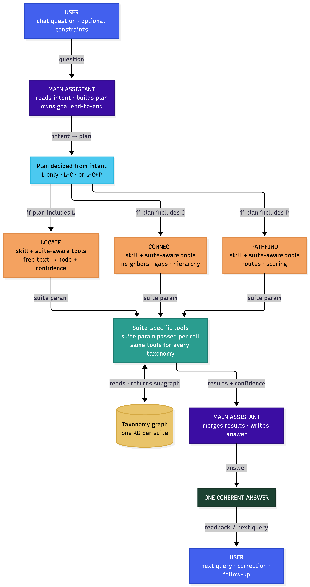
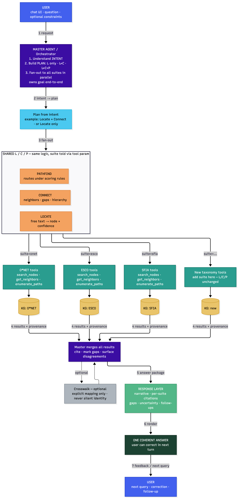
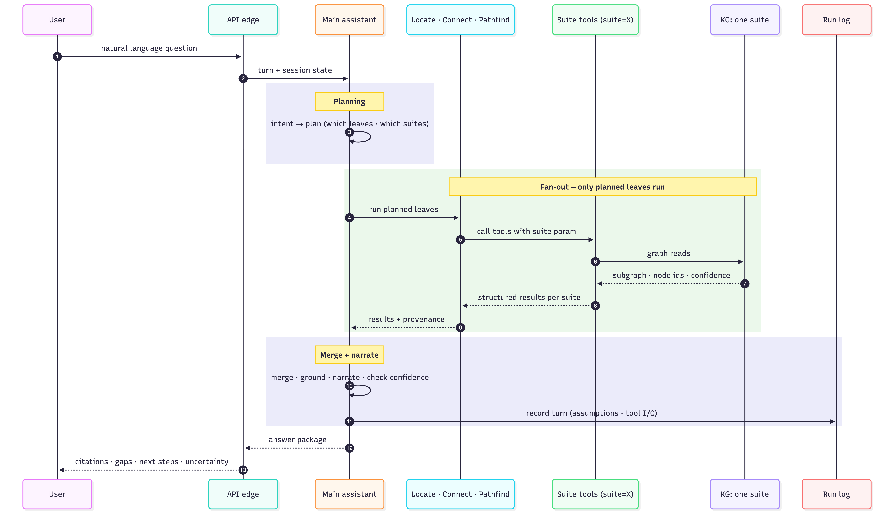

# Talent Angels Architecture

**Author:** Aman Kumar Sarraf  
**Sprint:** 2 · System Architecture  
**Companion:** `ONE-PAGER.md`  
**Taxonomy this author works with:** O\*NET  
**Out of scope:** production SaaS, accounts, payments, bulk proprietary dumps, full Evaluator product agent  

Living description of the proposed system. History lives in git.

---

## 1. Purpose

Talent Angels helps a person map themselves onto a trustworthy landscape of occupations, skills, and tasks, and choose next steps with evidence.

**Problem:**  
People struggle to understand where they stand among real occupations, skills, and tasks, and what to learn or try next with evidence they can trust.

**Users:** learners talking to one coherent assistant.  
**Builders:** the project team, each deep on different taxonomies. Concrete examples below use **O\*NET**; the control pattern is the same for every taxonomy suite.

---

## 2. Rules that do not bend

1. Only the **main assistant** finalizes the user-facing answer and changes the plan mid-session.  
2. Only a **taxonomy graph** is cited as taxonomy fact; model inference is labeled.  
3. Locate, Connect, and Pathfind **do not own** the user’s goal.  
4. They are **not** three equal product agents that answer the user alone.  
5. A “better path” is an **explicit policy**, not shortest path by default.  
6. Each taxonomy has its **own graph suite**. The same plan may run across suites; no invented cross-taxonomy identity.  
7. Every turn leaves a **structured run log** so quality review can attach later.  
8. **Confidence** on Locate results crosses every later step; high-stakes traversal may require user confirm.

---

## 3. Decomposition

### 3.1 Logic tree leaves → capabilities

From the problem, three functional leaves:

| Leaf | Meaning | Capability name |
|------|---------|-----------------|
| **Resolve** | Pin meaning to a precise map point | Locate |
| **Reveal** | Show surroundings of that point | Connect |
| **Compose** | Build routes between points under rules | Pathfind |

These leaves define **kinds of work**, not three peer product agents.

### 3.2 Who owns what

| Piece | Exclusive job | Shape |
|-------|---------------|--------|
| **Main assistant** | Intent once; plan; which leaves to run; honesty; final answer; multi-turn goal | One reasoner with tools and session state |
| **Locate** | Free text → candidates + confidence | Skills + tools; optional thin subagent only if isolation pays |
| **Connect** | Neighbors, hierarchy, gaps, comparisons | Skills + tools |
| **Pathfind** | Routes under declared scoring | Skills + tools |
| **Graph suite** | Nodes, edges, provenance for one taxonomy | Neo4j or equivalent per taxonomy |
| **Session and run log** | Assumptions; tool I/O | Structured logs / checkpoints |
| **Evaluator** | Future offline quality loop | Not a co-owner of the live answer |

### 3.3 Levels of capability

```text
Agent (main assistant)
  └─ Subagent (optional) — scoped job; short result returned upward
       └─ Skill — passive written procedure
            └─ Tool — deterministic external action
```

Move down only when the level above cannot finish alone. Skills do not execute. Tools know nothing of agents.

### 3.4 Why not three equal agents

| Problem | Detail |
|---------|--------|
| Overlap | Resolve already uses neighborhood; a path is ranked relations; gaps sit between reveal and compose |
| Gaps | Intent, honesty, multi-turn goal, and comparison without a path have no single L/C/P owner |
| Handoff cost | Real questions need more than one leaf; each handoff loses unstated context |
| Split judgment | Three “what is good?” owners produce three product philosophies |

**Claim:** one main assistant + MECE tools and skills over taxonomy graphs keeps coherence and lowers coordination cost.  
**Falsifier:** measured sessions where a single context fails and a narrow subagent with a clear written handoff improves quality without taking the user’s goal.

### 3.5 Multiple taxonomies

1. One main assistant for the user.  
2. One plan per request: resolve only; resolve + reveal; or all three leaves as needed.  
3. One **suite** per taxonomy (graph, entity rules, tools)—O\*NET, ESCO, SFIA, BLS, Lightcast, and others as present.  
4. **Fan-out:** the same plan can run on every available suite.  
5. **Merge:** cite sources; report disagreement and missing mapping.  
6. **Cross-taxonomy identity** only with an explicit mapping—never silent invention.  
7. **Ingestion** prepares structure and identity **within** a suite before query time so the conversation does not invent schema mid-turn.

---

## 4. End-to-end query flow

```text
User question
  → Main assistant (intent, constraints, session)
  → Plan: which leaves (Locate / Connect / Pathfind)
  → Run plan on each available taxonomy suite
  → Graph reads with provenance and confidence
  → Main assistant merges and writes one answer package
  → User sees place, surroundings or gaps, optional route, citations, uncertainty
  → Run log stores the turn
```

### 4.1 Topology (one suite)



_Source: `diagrams/goal-owner-decision-layer-LCP.mmd`_

### 4.2 Fan-out across suites



_Source: `diagrams/multi-taxonomy-master-agent-architecture.mmd`_

### 4.3 Sequence: chat → graph → back



_Source: `diagrams/chat-graph-sequence.mmd`_

### 4.4 Boundaries

| Boundary | What crosses | Why |
|----------|--------------|-----|
| User ↔ main assistant | Goal, constraints, corrections | Full goal continuity |
| Main assistant ↔ tools | Typed I/O, confidence | No goal re-homing in tools |
| Tools ↔ graph | Queries, subgraphs, provenance | Map is source of truth |
| Locate → later leaves | Node ids + confidence | Wrong pin poisons the chain |
| Suite ↔ suite | Same plan; suite-local results | Honest merge; no fake identity |

---

## 5. Conceptual model

**Learner model:** the taxonomy is a **territory**—find a place, look around, plot a route.  
**Builder model:** one main assistant; Locate / Connect / Pathfind as skills and tools; run logs; graphs as map truth; several suites under one control pattern.

| Need | Response |
|------|----------|
| Easy start | Natural language; one conversation surface |
| Know how to act | Clarify when ambiguous; hide internal tools |
| Know what happened | Citations, confidence, “not in map,” retained assumptions |
| Honest names | Do not present three competing product agents |
| Honest limits | No invented edges; no invented cross-taxonomy links |

---

## 6. Path quality and metrics

**Better path** may include feasibility, evidence strength, constraint fit, and explainability—not hop count alone.

**Design response to Locate error:** propagate confidence across boundaries; confirm high-stakes pins with the user before hard traversal; allow correction without restarting the whole session. That is a product failure mode; project delivery risks are listed in [Section 10](#10-risks-and-open-questions).

| Prefer measuring | Avoid as main score |
|------------------|---------------------|
| Correct resolve against gold | Number of agents invoked |
| Claims with graph provenance | Shortest path length alone |
| Appropriate “I don’t know” | Always answering |
| Recovery after correction | Token count alone |

---

## 7. Technology stack

| Concern | Choice | Justification |
|---------|--------|---------------|
| **Language** | Python 3.11+ | LangGraph, Pydantic v2, and the Neo4j Python driver are all Python-native. One language across orchestration, validation, graph access, and ingestion scripts eliminates cross-language friction at every boundary. |
| **Graph store** | Neo4j + Cypher | Skills, tasks, and occupations form a network of typed relationships — traversal and provenance require a graph database, not a relational or document store. Neo4j is the dominant property graph database for LLM/GraphRAG workflows in 2025–2026, with native Text-to-Cypher tooling, a public Text2Cypher-2025v1 dataset, and the deepest LLM integration of any graph database. Competitors (Memgraph, ArangoDB, KuzuDB) either carry BSL licensing restrictions, changed their open-source terms in 2024, or were archived in 2025. FalkorDB is a valid alternative but has a smaller ecosystem and less LLM tooling. |
| **Ingestion** | Python loaders per taxonomy suite | Each taxonomy ships in its own raw format — O\*NET as XML/CSV, ESCO as RDF/SKOS, SFIA as structured web tables. Per-suite loaders normalise all formats to a shared graph schema before any query runs. This is the architectural guarantee that the conversation never invents schema mid-turn (Rule 2 in [Section 2](#2-rules-that-do-not-bend)). |
| **Orchestration** | LangGraph | LangGraph models agent workflows as directed graphs with explicit state, conditional branching, and tool-call tracking — a direct match for the one-main-assistant pattern with plan branching (L / L+C / L+C+P) described in [Section 3](#3-decomposition). It is the only major framework built for stateful single-owner loops rather than peer-agent meshes. In 2025–2026 comparisons, LangGraph is rated the most production-ready option for observable, persistent agents. CrewAI is easier to start with but sacrifices state control; AutoGen is shifting away from major development; the OpenAI and Claude SDKs create vendor lock-in. |
| **Language model** | Claude Sonnet 5 (primary) | Claude 3.5 Sonnet was the top performer on CypherBench — the most rigorous graph query benchmark available — with 61.58% execution accuracy, ahead of GPT-4o. A 2026 follow-up study across four Text-to-Cypher benchmarks shows Claude averaging 78.58% vs GPT-5's 78.52%, a statistical tie. Claude Sonnet 5 is the current generation above 3.5 Sonnet. Strong structured tool-use is critical here: every Locate, Connect, and Pathfind step is a typed tool call returning a Pydantic model — Claude's tool-use reliability directly impacts answer quality. Provider is configured via environment variable so teams can substitute GPT-5 or another model without touching agent code. |
| **Structured I/O** | Pydantic v2 | Pydantic is the de facto validation layer for LLM outputs in 2025–2026 — used internally by the OpenAI SDK, Anthropic SDK, LangChain, LangGraph, LlamaIndex, CrewAI, and Instructor. Every tool input and answer package in this system has a fixed schema defined as a Pydantic model; validation is enforced at the framework boundary before business logic runs, eliminating the entire class of "almost-right JSON" bugs. LangGraph's typed state integrates with Pydantic natively. |
| **Embeddings** | sentence-transformers — `BAAI/bge-m3` (optional) | Fuzzy Locate fallback only — used when a user's wording does not match taxonomy labels exactly. BGE-M3 runs fully locally (no API calls, no per-token cost, no data leaving the system), sits in the top 20 of the MTEB leaderboard as of 2026, and outperforms `text-embedding-ada-002` on retrieval tasks. It is not part of the primary query path — graph Cypher queries handle all primary lookups. |
| **API edge** | FastAPI | FastAPI is the default Python web framework for LLM and AI agent backends in 2026: async-native (Uvicorn + Starlette), Pydantic v2 integrated at the framework boundary, handles 3,000+ RPS, and supports streaming responses for token-by-token output. Flask lacks async; Django REST's synchronous ORM becomes a bottleneck when endpoints spend seconds waiting on LLM responses. FastAPI is a thin edge only — all reasoning stays inside the LangGraph agent loop. |

Change a row only when a rule in [Section 2](#2-rules-that-do-not-bend) or a boundary in [Section 4](#4-end-to-end-query-flow) changes.

---

## 8. Skills and tools

| Package | Example skill | Example tools |
|---------|---------------|---------------|
| Locate | How to disambiguate titles in a suite | `search_nodes`, `rank_candidates`, `get_node` |
| Connect | How to present gaps honestly | `get_neighbors`, `set_diff`, `traverse_hierarchy` |
| Pathfind | How to score routes under criteria | `enumerate_paths`, `score_paths`, `explain_path` |
| Honesty | When to refuse or hedge | `cite`, `flag_missing` |

---

## 9. Evaluation later

| Now | Later |
|-----|--------|
| Structured run log per turn | Offline quality loop |
| Provenance on graph claims | Broader human path ranking |
| Small golden questions for each leaf | Larger evaluation suite |

---

## 10. Risks

### 10.1 Project risks

A **risk** is something uncertain that might occur and would hurt the project if it does (block implementation, delay delivery, force rework). It is not a problem already accepted as fact. Capture early; revisit each sprint.

| Risk | If it happens | Mitigation |
|------|----------------|------------|
| Team freezes **three equal L/C/P agents** without one goal owner | Contracts and code rewritten before a first working loop | One main assistant owns the answer; L/C/P are skills and tools ([Section 3](#3-decomposition)) |
| **Stack chosen before** shared architecture is agreed | Rebuild of APIs, graphs, and agent wiring | Stack only when forced by [Sections 2–4](#2-rules-that-do-not-bend) decisions ([Section 7](#7-technology-stack)) |
| **No shared suite contract** across taxonomies | Parallel graphs cannot plug into one assistant | Same plan shape per suite; fan-out and honest merge ([Section 3.5](#35-multiple-taxonomies)) |
| **Silent cross-taxonomy identity** | Bad merged answers; trust and eval collapse | Explicit mapping only; report “no link” ([Section 2](#2-rules-that-do-not-bend) and [Section 3.5](#35-multiple-taxonomies)) |
| **Scope creep** (full Evaluator, agent zoo, hop-KPI demos) | Core loop slips | Out-of-scope list; run log seam ([Section 9](#9-evaluation-later)); metrics in [Section 6](#6-path-quality-and-metrics) |
| **Wrong Locate in production** poisons later steps | Confident wrong paths; product trust fails | Confidence + confirm + correction ([Section 4.4](#44-boundaries) and [Section 6](#6-path-quality-and-metrics)) |

### 10.2 Design failure modes (not the same as project risks)

These are ways the **running system** can fail if we ignore the architecture—not uncertain delivery events, but reasons the boundaries exist:

| Failure mode | Guard |
|--------------|--------|
| Peer agents split judgment | Invariants in [Section 2](#2-rules-that-do-not-bend) |
| Hop count treated as path quality | Metrics in [Section 6](#6-path-quality-and-metrics) |
| Tools set product philosophy | Scoring and honesty stay with the main assistant |
| Diagrams push three equal agents for visual balance | One-pager and [Section 3](#3-decomposition) stay normative |

---

## 11. Growth

- Deepen tools and golden questions for each suite the team already knows.  
- Add a suite with the same plan contract; do not add a second main assistant.  
- Promote a subagent only with measured benefit and a clear written handoff.  
- Keep this file current; put history in git.

---

## 12. Sprint requirements map

| Requirement | Section |
|-------------|---------|
| Agent architecture diagram | [Sections 3–4](#3-decomposition) |
| Stack chosen and justified | [Section 7](#7-technology-stack) |
| Query flow chat → graph → back | [Section 4](#4-end-to-end-query-flow) |
