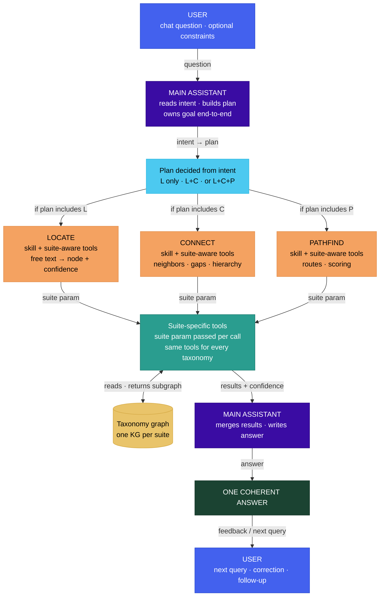
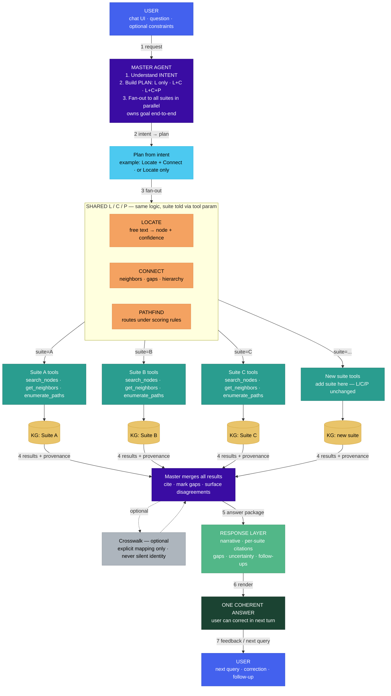
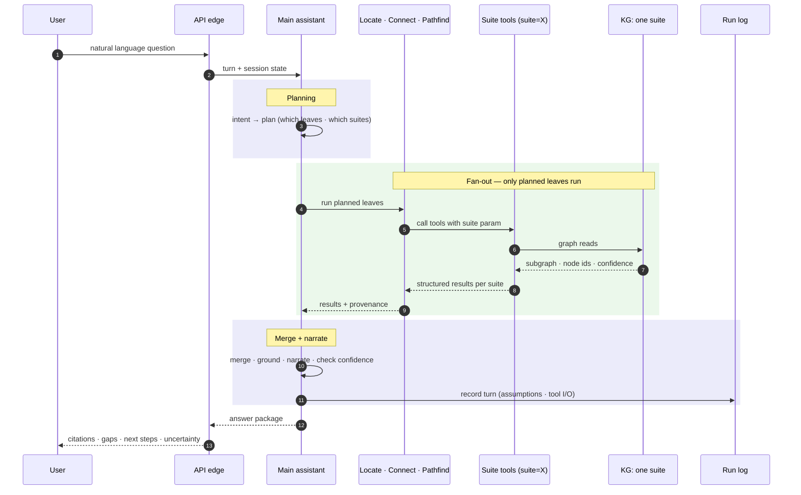

# Talent Angels Architecture

**Author:** Aman Kumar Sarraf  
**Sprint:** 2 · System Architecture  
**Companion:** `ONE-PAGER.md`  
**Out of scope:** production SaaS, accounts, payments, bulk proprietary dumps, full Evaluator product agent  

Living description of the proposed system. History lives in git.

---

## 1. Purpose

Talent Angels helps a person map themselves onto a trustworthy landscape of occupations, skills, and tasks, and choose next steps with evidence.

**Problem:**  
People struggle to understand where they stand among real occupations, skills, and tasks, and what to learn or try next with evidence they can trust.

**Users:** learners talking to one coherent assistant.  
**Builders:** the project team, each deep on a different taxonomy suite. The control pattern is the same for every suite.

### 1.1 Experiment questions

Every agent capability starts from a narrow, testable question. If the question is vague, the architecture becomes vague.

| Capability | Experiment question |
|---|---|
| **Locator** | Can we reliably find the graph node for a skill or occupation mentioned in plain English, and attach a confidence score? |
| **Connector** | Can we explain the immediate neighbors of a resolved node — grouped by relationship type, with evidence — without inventing edges? |
| **Pathfinder** | Can we produce a plausible, explainable route between two resolved nodes using only edges that exist in the graph? |

---

## 2. Rules that do not bend

1. Only the **main assistant** finalizes the user-facing answer and changes the plan mid-session.  
2. Only a **taxonomy graph** is cited as taxonomy fact; model inference is labeled.  
3. Locate, Connect, and Pathfind **do not own** the user's goal.  
4. They are **not** three equal product agents that answer the user alone.  
5. A "better path" is an **explicit policy**, not shortest path by default.  
6. Each taxonomy has its **own graph suite**. The same plan may run across suites; no invented cross-taxonomy identity.  
7. Every turn leaves a **structured run log** so quality review can attach later.  
8. **Confidence** on Locate results crosses every later step; high-stakes traversal may require user confirm.

---

## 3. Decomposition

### 3.1 Logic tree leaves → capabilities

From the problem, three functional leaves:

| Leaf | Meaning | Capability name |
|------|---------|-----------------|
| **Resolve** | Pin meaning to a precise map point | Locate |
| **Reveal** | Show surroundings of that point | Connect |
| **Compose** | Build routes between points under rules | Pathfind |

These leaves define **kinds of work**, not three peer product agents.

### 3.2 Who owns what

| Piece | Exclusive job | Shape |
|-------|---------------|--------|
| **Main assistant** | Intent once; plan; which leaves to run; honesty; final answer; multi-turn goal | One reasoner with tools and session state |
| **Locate** | Free text → candidates + confidence | Skills + tools; optional thin subagent only if isolation pays |
| **Connect** | Neighbors, hierarchy, gaps, comparisons | Skills + tools |
| **Pathfind** | Routes under declared scoring | Skills + tools |
| **Graph suite** | Nodes, edges, provenance for one taxonomy | Neo4j or equivalent per taxonomy |
| **Session and run log** | Assumptions; tool I/O | Structured logs / checkpoints |
| **Evaluator** | Future offline quality loop | Not a co-owner of the live answer |

**Surgical team mapping.** The main assistant is the surgeon: the one mind that cuts, decides, and owns the outcome. Locate, Connect, and Pathfind are instruments — specialized, excellent at one job, silent about the goal. The run log is the only structure kept today that exists solely to serve the future Evaluator. Its cost is one structured write per turn. If the Evaluator never arrives, the log is overhead; if it does, retrofitting would cost far more.

### 3.3 Levels of capability

```text
Agent (main assistant)
  └─ Locate / Connect / Pathfind — always invoked; implementation varies
       ├─ as inline skill + tool calls  (default — stays in main assistant's context)
       └─ as a scoped subagent          (only when context isolation pays)
            └─ Skill — passive written procedure
                 └─ Tool — deterministic external action
```

L/C/P are not optional — the main assistant always dispatches them according to the plan. What is optional is **isolation**: whether each runs as a thin subagent with its own context (result returned upward) or as inline skill + tool calls within the main assistant's context. Go to subagent only when a task is complex enough that running it inline would pollute the main assistant's working context. Skills do not execute. Tools know nothing of agents.

### 3.4 Why not three equal agents

| Problem | Detail |
|---------|--------|
| Overlap | Resolve already uses neighborhood; a path is ranked relations; gaps sit between reveal and compose |
| Gaps | Intent, honesty, multi-turn goal, and comparison without a path have no single L/C/P owner |
| Handoff cost | Real questions need more than one leaf; each handoff loses unstated context |
| Split judgment | Three "what is good?" owners produce three product philosophies |

**Claim:** one main assistant + MECE tools and skills over taxonomy graphs keeps coherence and lowers coordination cost.  
**Falsifier:** measured sessions where a single context fails and a narrow subagent with a clear written handoff improves quality without taking the user's goal.

### 3.5 Multiple taxonomies

1. One main assistant for the user.  
2. One plan per request: resolve only; resolve + reveal; or all three leaves as needed.  
3. One **suite** per taxonomy (graph, entity rules, tools) — each suite is independently queryable.  
4. **Fan-out:** the same plan runs on every available suite in parallel.  
5. **Merge:** cite sources; report disagreement and missing mapping.  
6. **Cross-taxonomy identity** only with an explicit mapping — never silent invention.  
7. **Ingestion** prepares structure and identity **within** a suite before query time so the conversation does not invent schema mid-turn.

**Suite as a self-contained package.** Each suite ships as a unit: its own loader, its own tools (`search_nodes`, `get_neighbors`, `enumerate_paths`), and its own graph. L/C/P are suite-agnostic — they call tools with a `suite` parameter and receive the same structured result regardless of which graph answered. Adding a new taxonomy means adding one new suite package. Nothing else changes.

---

## 4. End-to-end query flow

```text
User question
  → Main assistant (intent, constraints, session)
  → Plan: which leaves (Locate / Connect / Pathfind)
  → Run plan on each available taxonomy suite
  → Graph reads with provenance and confidence
  → Main assistant merges and writes one answer package
  → User sees place, surroundings or gaps, optional route, citations, uncertainty
  → Run log stores the turn
```

### 4.1 Topology (one suite)



_PNG fallback: `diagrams/one-taxonomy.png` · source: `diagrams/goal-owner-decision-layer-LCP.mmd`_

### 4.2 Fan-out across suites



_PNG fallback: `diagrams/multi_taxonomy_design.png` · source: `diagrams/multi-taxonomy-master-agent-architecture.mmd`_

> **Note:** the PNG shows O\*NET/ESCO/SFIA by name (sprint deliverable); the Mermaid above is the KG-agnostic canonical version.

### 4.3 Sequence: chat → graph → back



_PNG fallback: `diagrams/user_query_flow.png` · source: `diagrams/chat-graph-sequence.mmd`_

### 4.4 Boundaries

| Boundary | What crosses | Why |
|----------|--------------|-----|
| User ↔ main assistant | Goal, constraints, corrections | Full goal continuity |
| Main assistant ↔ tools | Typed I/O, confidence | No goal re-homing in tools |
| Tools ↔ graph | Queries, subgraphs, provenance | Map is source of truth |
| Locate → later leaves | Node ids + confidence | Wrong pin poisons the chain |
| Suite ↔ suite | Same plan; suite-local results | Honest merge; no fake identity |

### 4.5 Numbered walkthrough

A plain-language example tracing a full path question through the system:

```text
User: "I know Python scripting. I want to become a data engineer. What should I learn?"

1. Main assistant reads intent → path question → plan is Locate + Connect + Pathfind.

2. Locate runs for the start concept on each available suite.
   Tool: search_nodes(query="Python scripting", suite=<each>)
   Returns: node_id, label, confidence per suite.

3. Locate runs for the target concept on each available suite.
   Tool: search_nodes(query="data engineer", suite=<each>)
   Returns: node_id, label, confidence per suite.

4. Connect maps the neighborhood around the resolved start node.
   Tool: get_neighbors(node_id, suite=<each>)
   Returns: adjacent nodes grouped by relationship type.

5. Pathfind traces routes from start to target within each suite.
   Tool: enumerate_paths(start_id, end_id, suite=<each>)
   Tool: score_paths(paths, scoring_policy)
   Returns: ranked routes with edge-level provenance.

6. Main assistant receives all suite results.
   Merge: suites agree      → confident claim with citations.
          suites disagree   → surface disagreement; show both.
          no path found     → say so; never invent a bridge.

7. User sees: cited route, confidence on each step, gaps noted, corrections invited.
   Run log stores: intent, plan, tool I/O, merge decisions, final answer.
```

---

## 5. Conceptual model

**Learner model:** the taxonomy is a **territory** — find a place, look around, plot a route.  
**Builder model:** one main assistant; Locate / Connect / Pathfind as skills and tools; run logs; graphs as map truth; several suites under one control pattern.

| Need | Response |
|------|----------|
| Easy start | Natural language; one conversation surface |
| Know how to act | Clarify when ambiguous; hide internal tools |
| Know what happened | Citations, confidence, "not in map," retained assumptions |
| Honest names | Do not present three competing product agents |
| Honest limits | No invented edges; no invented cross-taxonomy links |

### 5.1 Closing the two gulfs

Norman identifies two failure points in any system: the **gulf of execution** ("how do I make it do what I want?") and the **gulf of evaluation** ("what just happened — did it work?").

| Gulf | Where it opens in this system | How the design closes it |
|------|-------------------------------|--------------------------|
| Execution | User doesn't know what kind of question the system can answer | Main assistant accepts any natural-language input; no commands, no syntax |
| Execution | User doesn't know whether to say "find" or "connect" or "path" | The plan is derived from intent, not from a mode the user must select |
| Evaluation | User can't tell if the answer is based on real data or model inference | Every claim carries a citation and a confidence score; model inference is labeled |
| Evaluation | User doesn't know if a wrong answer was the system's fault | "Not in graph" and "low confidence" responses are explicit, not hidden behind a fluent-sounding answer |

### 5.2 What the graph can and cannot express

The choice to represent knowledge as a property graph shapes what is easy and what is impossible to ask.

**Easy to express:**
- Typed relationships between nodes (skill belongs to occupation, task requires skill)
- Provenance — every edge can carry a source citation
- Multi-hop paths between any two nodes
- Hierarchies (BROADER_THAN) and lateral links (RELATED_TO)

**Cannot express without additional modeling:**
- Temporal change — a skill that was important in 2020 and declining in 2026 looks the same as one that is stable
- Strength of absence — the graph can say "no edge found" but cannot say "this skill is actively avoided in this occupation"
- Subjective fit — whether a path suits a specific learner's constraints (time, geography, risk tolerance) is outside the graph; it must be declared by the user and applied by the main assistant

These limits are not bugs. They are the boundary conditions that keep the graph honest. The main assistant must not invent edges to fill what the graph cannot express.

---

## 6. Canonical graph vocabulary

A small shared vocabulary so experiments across suites can be compared. Additions should come from repeated need across multiple taxonomy experiments, not speculation.

### Nodes

| Node | Meaning |
|------|---------|
| `Skill` | A capability someone can learn or demonstrate |
| `Task` | Work someone performs |
| `Occupation` | A role, job family, or occupational profile |
| `Framework` | Source taxonomy or standard |
| `Level` | A proficiency or responsibility level |
| `Evidence` | Source-backed text, table row, or citation |

### Edges

| Edge | Meaning |
|------|---------|
| `HAS_SKILL` | An occupation or task is associated with a skill |
| `PERFORMS_TASK` | An occupation includes a task |
| `BROADER_THAN` | Hierarchy between concepts |
| `RELATED_TO` | Non-hierarchical relationship |
| `HAS_LEVEL` | Skill is described at a proficiency level |
| `SUPPORTED_BY` | Node or edge has source evidence |
| `MAY_LEAD_TO` | Possible learning or career transition |

Every suite maps its native schema to this shared vocabulary before query time. This is what makes fan-out and merge possible without invented cross-taxonomy identity.

---

## 7. Agent design

Each capability has a distinct job, internal flow, and definition of good behavior. None of the three owns the user's goal — that stays with the main assistant.

### 7.1 Locator

Maps a free-text phrase to a graph node with a confidence score.

```text
query text
  → normalize phrase
  → search labels and aliases (exact match first, fuzzy via embeddings as fallback)
  → rank candidates by confidence
  → return best node_id + confidence, or surface alternatives if ambiguous
```

**Good behavior:**
- Returns alternatives when a term is ambiguous
- Distinguishes skills from occupations from tasks
- Explains which label or alias matched
- Refuses to invent a node when none exists in the suite
- Propagates confidence downstream — a low-confidence pin flags the whole chain

### 7.2 Connector

Maps the neighborhood of a resolved node.

```text
node_id (from Locator)
  → select relevant edge types
  → retrieve immediate neighbors
  → group results by relationship type and direction
  → return with source evidence per edge
```

**Good behavior:**
- Groups neighbors by edge type, not a flat undifferentiated list
- Keeps direction explicit (predecessor vs successor)
- Reports when a node has sparse or no neighbors
- Cites the edge and its source evidence
- Does not invent neighbors absent from the graph

### 7.3 Pathfinder

Traces routes between two resolved nodes under declared scoring rules.

```text
source phrase → Locator → source node_id + confidence
target phrase → Locator → target node_id + confidence
source + target
  → constrained path search (depth limit, no cycles)
  → score paths under declared policy (not hop count alone)
  → explain each step with evidence
```

**Good behavior:**
- States assumptions about source and target before traversing
- Limits path depth; avoids combinatorial blowup
- Uses only edges that exist in the suite's graph
- Returns no path when none exists — never fabricates a bridge
- Separates "found in graph" from "plausible but not represented"
- Scoring policy is explicit and documented before traversal

---

## 8. Structured output

Every agent returns structured output before prose. Tests and the merge step validate objects, not free text.

```json
{
  "agent": "Locator",
  "suite": "<taxonomy suite name>",
  "answer": "Closest match is 'Data Analysis'.",
  "nodes": [
    {
      "id": "skill:data-analysis",
      "label": "Data Analysis",
      "type": "Skill",
      "confidence": 0.91
    }
  ],
  "edges": [],
  "evidence": [
    {
      "source": "suite-fixture",
      "id": "evidence:042",
      "text": "Data Analysis — ability to collect, organise, and interpret data sets."
    }
  ],
  "warnings": []
}
```

Pydantic model shape (all agents share this base):

```python
class AgentResult(BaseModel):
    agent: Literal["Locator", "Connector", "Pathfinder"]
    suite: str
    answer: str
    nodes: list[GraphNode]
    edges: list[GraphEdge]
    evidence: list[EvidenceItem]
    warnings: list[str]
```

Natural-language prose is appended after the structured result. This makes tests and the merge step predictable.

---

## 9. Failure modes

The architecture names expected failures so the system responds correctly rather than silently.

| Failure | Example | Expected behavior |
|---------|---------|-------------------|
| Ambiguous term | "engineer" matches multiple node types | Return alternatives; ask user to clarify |
| Missing node | Concept not present in any suite | Say it is not in the graph; do not invent it |
| Sparse graph | Node has no neighbors in a suite | Report sparse context; do not pad with inference |
| No path | Source and target are disconnected | Return no path found; never fabricate a bridge |
| Low-confidence pin | Locator confidence below threshold | Confirm with user before hard traversal |
| Suite disagreement | Two suites return conflicting results | Surface disagreement explicitly; show both |
| Weak evidence | Relationship exists but has no source citation | Mark as lower confidence; flag in warnings |
| System-level failure | Each of L, C, P returns a correct result in isolation, but the main assistant merges them on mismatched node IDs from different suites | Node IDs must be suite-scoped; merge operates on suite-local results, never assumes cross-suite identity |

---

## 10. Path quality and metrics

**Better path** may include feasibility, evidence strength, constraint fit, and explainability — not hop count alone.

**Design response to Locate error:** propagate confidence across boundaries; confirm high-stakes pins with the user before hard traversal; allow correction without restarting the whole session.

| Prefer measuring | Avoid as main score |
|------------------|---------------------|
| Correct resolve against gold | Number of agents invoked |
| Claims with graph provenance | Shortest path length alone |
| Appropriate "I don't know" | Always answering |
| Recovery after correction | Token count alone |

---

## 11. Technology stack

| Concern | Choice | Justification |
|---------|--------|---------------|
| **Language** | Python 3.11+ | LangGraph, Pydantic v2, and the graph driver are all Python-native. One language across orchestration, validation, graph access, and ingestion scripts eliminates cross-language friction at every boundary. |
| **Graph store** | Neo4j + Cypher | Skills, tasks, and occupations form a network of typed relationships — traversal and provenance require a graph database, not a relational or document store. Neo4j is the dominant property graph database for LLM/GraphRAG workflows in 2025–2026, with native Text-to-Cypher tooling and the deepest LLM integration of any graph database. |
| **Ingestion** | Python loaders per taxonomy suite | Each taxonomy suite ships in its own native format. Per-suite loaders normalise all formats to the shared canonical graph schema before any query runs. This is the architectural guarantee that the conversation never invents schema mid-turn (Rule 2 in [Section 2](#2-rules-that-do-not-bend)). |
| **Orchestration** | LangGraph | LangGraph models agent workflows as directed graphs with explicit state, conditional branching, and tool-call tracking — a direct match for the one-main-assistant pattern with plan branching (L / L+C / L+C+P). It is the only major framework built for stateful single-owner loops rather than peer-agent meshes. |
| **Language model** | Claude Sonnet 5 (primary) | Top performer on CypherBench (graph query benchmark) and a 2026 follow-up across four Text-to-Cypher benchmarks. Strong structured tool-use is critical: every Locate, Connect, and Pathfind step is a typed tool call returning a Pydantic model. Provider configured via environment variable — substituting another model requires no agent code changes. |
| **Structured I/O** | Pydantic v2 | De facto validation layer for LLM outputs in 2025–2026. Every tool input and answer package has a fixed schema; validation is enforced at the framework boundary before business logic runs. |
| **Embeddings** | `BAAI/bge-m3` via sentence-transformers (optional) | Fuzzy Locate fallback only — used when a user's wording does not match taxonomy labels exactly. Runs fully locally; no API calls, no data leaving the system. Not part of the primary query path. |
| **API edge** | FastAPI | Async-native, Pydantic v2 integrated, handles streaming responses. A thin edge only — all reasoning stays inside the LangGraph agent loop. |

Change a row only when a rule in [Section 2](#2-rules-that-do-not-bend) or a boundary in [Section 4](#4-end-to-end-query-flow) changes.

### 11.1 Taxonomy suite formats

Each suite ships in its own native format. The loader is the only place that knows about this format — the rest of the system sees the canonical graph schema.

| Suite | Native format | Loader approach |
|-------|--------------|-----------------|
| O\*NET | XML / TSV tables | Per-table parsers; rating scales normalised to edge properties |
| ESCO | RDF / SKOS (JSON-LD) | JSON-LD parser; multilingual labels collapsed to primary label |
| SFIA | Structured web tables | Published CSV or scraper; responsibility levels map to `Level` nodes |
| BLS | Flat files / prose profiles | Statistical tables + text extraction; outlook data as node properties |
| Lightcast | Licensed API / CSV | API client; commercial schema normalised to canonical vocabulary |

---

## 12. Skills and tools

| Package | Example skill | Example tools |
|---------|---------------|---------------|
| Locate | How to disambiguate titles in a suite | `search_nodes`, `rank_candidates`, `get_node` |
| Connect | How to present gaps honestly | `get_neighbors`, `set_diff`, `traverse_hierarchy` |
| Pathfind | How to score routes under criteria | `enumerate_paths`, `score_paths`, `explain_path` |
| Honesty | When to refuse or hedge | `cite`, `flag_missing` |

---

## 13. Success criteria

The system succeeds when these are all true at once — not each part in isolation.

| Criterion | How to verify |
|-----------|---------------|
| **Correct resolve** — Locator finds the right node for a plain-language input | Golden eval cases pass; top candidate matches expected concept at required confidence |
| **Grounded claims** — every fact the system states can be traced to a graph edge with a source citation | No claim appears in the answer without a corresponding evidence entry in the structured output |
| **Honest limits** — when a concept is not in the graph, the system says so | "Not in graph" and "no path found" responses fire on known-absent cases; no fabricated bridges |
| **Error recovery** — a user can correct a wrong location without restarting the session | Correction is accepted in the next turn; the main assistant updates its working assumption and continues |
| **Suite extensibility** — adding a new taxonomy requires only a new suite package | L/C/P and Main Assistant code is unchanged; new suite passes all eval cases with its own fixture |
| **Honest disagreement** — when two suites conflict, both views are shown | Merge output carries both results with provenance; no silent averaging |
| **Scoring is explicit** — a better path is not defined by hop count | Path scoring policy is declared before traversal; eval cases test scoring, not just reachability |

The system fails if it produces a confident, fluent answer that cannot be traced to the graph. Fluency without provenance is the primary failure mode to guard against.

---

## 14. Evaluation

### 14.1 Evaluation areas

| Area | Check |
|------|-------|
| Ingestion | Every fixture row becomes the expected nodes and edges |
| Graph model | No dangling or orphaned edges |
| Locator | Top candidate matches expected concept; confidence reflects match quality |
| Connector | Returned neighbors are real graph neighbors; direction is correct |
| Pathfinder | Every path starts and ends at the requested concepts; no fabricated edges |
| Answering | Citations point to actual fixture evidence |
| Honesty | "No path" and "not in graph" responses fire correctly |

### 14.2 Golden eval cases

Tiny evals are better than impressive demos that cannot be reproduced.

**Locator:**
```yaml
- query: "data visualisation"
  expected_node: "skill:data-visualisation"
  accepted_alternatives:
    - "skill:visual-communication"
  min_confidence: 0.75
```

**Connector:**
```yaml
- node: "occupation:data-analyst"
  edge_type: "HAS_SKILL"
  must_include:
    - "skill:data-analysis"
  must_not_include: []
  report_sparse: true
```

**Pathfinder:**
```yaml
- from: "occupation:customer-support-specialist"
  to: "occupation:data-analyst"
  max_depth: 4
  path_must_start_with: "occupation:customer-support-specialist"
  path_must_end_with: "occupation:data-analyst"
  no_fabricated_edges: true
```

### 14.3 Promotion criteria

An experiment is ready to promote to `TA-agents` when:

- It has a readable committed fixture
- It has repeatable evals that pass
- Output is structured (Pydantic-validated)
- Failure behavior is documented and tested
- Graph assumptions are written down
- At least one other contributor can reproduce it

Promotion does not mean "ship to production." It means the pattern is clear enough to reuse in the main project.

---

## 15. Risks

### 15.1 Project risks

| Risk | If it happens | Mitigation |
|------|----------------|------------|
| Team freezes **three equal L/C/P agents** without one goal owner | Contracts and code rewritten before a first working loop | One main assistant owns the answer; L/C/P are skills and tools ([Section 3](#3-decomposition)) |
| **Stack chosen before** shared architecture is agreed | Rebuild of APIs, graphs, and agent wiring | Stack only when forced by [Sections 2–4](#2-rules-that-do-not-bend) decisions ([Section 11](#11-technology-stack)) |
| **No shared suite contract** across taxonomies | Parallel graphs cannot plug into one assistant | Same plan shape per suite; fan-out and honest merge ([Section 3.5](#35-multiple-taxonomies)) |
| **Silent cross-taxonomy identity** | Bad merged answers; trust and eval collapse | Explicit mapping only; report "no link" ([Section 2](#2-rules-that-do-not-bend) and [Section 3.5](#35-multiple-taxonomies)) |
| **Scope creep** (full Evaluator, agent zoo, hop-KPI demos) | Core loop slips | Out-of-scope list; run log seam ([Section 14](#14-evaluation)); metrics in [Section 10](#10-path-quality-and-metrics) |
| **Wrong Locate in production** poisons later steps | Confident wrong paths; product trust fails | Confidence + confirm + correction ([Section 4.4](#44-boundaries) and [Section 10](#10-path-quality-and-metrics)) |
| **Feedback loop** — learners follow recommended paths, which changes the real skill landscape, which the graph no longer reflects | System maps a world that no longer exists; confident answers become systematically wrong | Taxonomies are versioned external sources, not derived from system usage. The graph reflects the taxonomy, not learner behaviour. This seam must be explicit in the ingestion contract. |

### 15.2 Design failure modes

| Failure mode | Guard |
|--------------|--------|
| Peer agents split judgment | Invariants in [Section 2](#2-rules-that-do-not-bend) |
| Hop count treated as path quality | Metrics in [Section 10](#10-path-quality-and-metrics) |
| Tools set product philosophy | Scoring and honesty stay with the main assistant |
| Diagrams push three equal agents for visual balance | One-pager and [Section 3](#3-decomposition) stay normative |

---

## 16. Growth

- Deepen tools and golden questions for each suite the team already knows.  
- Add a suite with the same plan contract; do not add a second main assistant.  
- Promote a subagent only with measured benefit and a clear written handoff.  
- Keep this file current; put history in git.

---

## 17. Sprint requirements map

| Requirement | Section |
|-------------|---------|
| Agent architecture diagram | [Sections 3–4](#3-decomposition) |
| Stack chosen and justified | [Section 11](#11-technology-stack) |
| Query flow chat → graph → back | [Section 4](#4-end-to-end-query-flow) |
| Success criteria | [Section 13](#13-success-criteria) |
| Risks | [Section 15](#15-risks) |
