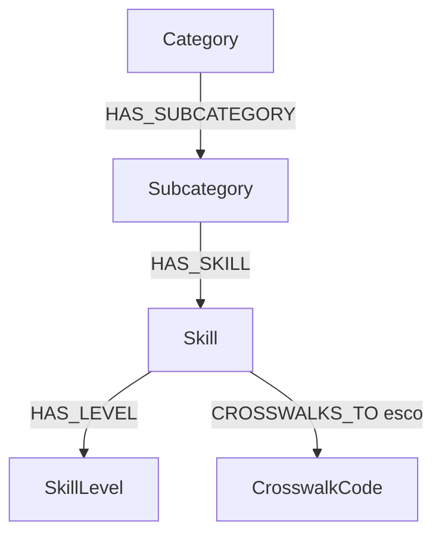

# Sprint 1 — SFIA Knowledge Graph slice

## Which taxonomy

The **Skills Framework for the Information Age (SFIA)** is a globally
recognized framework used to define professional skills, competencies, and
responsibilities within the technology and digital workforce.

SFIA organizes information into:

* Categories
* Subcategories
* Skills
* Responsibility Levels (1–7)

Each skill can exist at one or more responsibility levels, with increasing
scope, autonomy, influence, and leadership as the level increases.

| Level | Description                     |
| ----- | ------------------------------- |
| 1     | Follow                          |
| 2     | Assist                          |
| 3     | Apply                           |
| 4     | Enable                          |
| 5     | Ensure, Advise                  |
| 6     | Initiate, Influence             |
| 7     | Set Strategy, Inspire, Mobilise |

Unlike ESCO, O\*NET, BLS, and Lightcast, **SFIA has no occupations**: it is a
pure skills-and-levels framework. That shapes everything below.

## Where the data comes from (+ license)

- **Framework site:** <https://sfia-online.org/> — the full framework is
  browsable and downloadable after free registration.
- **Licensing:** <https://sfia-online.org/en/about-sfia/licensing-sfia>
- **The key finding: SFIA is the one taxonomy in our set with restrictive
  licensing.** ESCO, O\*NET, and BLS are open government/EU data, and
  Lightcast has an open core — but SFIA is free **only for personal,
  non-commercial use** (registration required), and any organizational use
  requires a paid license.
- What this means for the project: TA-agents is Apache-2.0, so we cannot ship
  verbatim SFIA text (level descriptions, skill definitions) without clearing
  licensing with the SFIA Foundation. This slice therefore models the
  **structure** (codes, names, level numbers) with **short paraphrases** of
  the level descriptions, written for learning purposes — not verbatim SFIA
  text. Any TA-agents feature that depends on SFIA must either stay in the
  personal-use lane, obtain a license, or degrade to structure-only.

## Graph model

- Node labels: `Category`, `Subcategory`, `Skill`, `SkillLevel`,
  `CrosswalkCode`.
- **`SkillLevel` is a first-class node, not a property.** The description of a
  skill changes at every responsibility level — level 4 IRMG and level 7 IRMG
  are genuinely different things — so each (skill, level) pair gets its own
  node with `level` and `description`. This is SFIA's unique dimension, and
  flattening it into a property would lose the ability to query levels as
  entry points ("show me everything defined at level 6").
- Every node carries `source: "sfia"` and a `source_id`, the project-wide
  convention so nodes from different taxonomies can coexist without ID
  collisions. SFIA skill codes (`ITSP`, `IRMG`, …) are natural `source_id`s;
  levels use `"<CODE>-<level>"` (e.g. `"ITSP-4"`); categories and
  subcategories have no official codes, so slugs are used.
- Since SFIA publishes no official crosswalks, the `CROSSWALKS_TO` edges are
  hand-made illustrative skill-to-skill mappings into ESCO (marked as such).

### Sample slice

| Skill | Code | Category > Subcategory | Levels modelled |
| ----- | ---- | ---------------------- | --------------- |
| Strategic planning | ITSP | Strategy and architecture > Strategy and planning | 4–7 |
| Information systems coordination | ISCO | Strategy and architecture > Strategy and planning | 6–7 |
| Information management | IRMG | Strategy and architecture > Strategy and planning | 3–7 |
| Programming/software development | PROG | Development and implementation > Systems development | 3–4 (of 2–6) |
| Testing | TEST | Development and implementation > Systems development | 2, 4 (of 1–6) |

See [`graph.cypher`](graph.cypher) for the build script,
[`queries.cypher`](queries.cypher) for the example questions, and
[`visualisation.svg`](visualisation.svg) for a rendered view of the original
three-skill slice.

## Example questions the graph answers

1. *Locator:* "Where does 'Strategic planning' live in SFIA?" — resolve a
   skill to its subcategory and category, and list its defined levels.
2. *Connector:* "What does Information management look like at each
   responsibility level?" — the progression inside a single skill.
3. *Connector (inverse):* "Which skills are defined at responsibility
   level 6?" — levels as entry points, which is what the `SkillLevel` node
   modelling buys us.
4. *Pathfinder:* "What connects Information management to Programming?" —
   with no occupations to bridge through, shared responsibility levels and
   the category tree are the bridges.
5. *Gap analysis (Evaluator preview):* "I hold IRMG at level 4 — what is left
   to reach level 7?" — SFIA's natural gap is vertical (level progression),
   not a missing-skills list.
6. *Crosswalk:* "Which ESCO skills do our SFIA skills map to?" — the door
   from SFIA into the occupation-centric taxonomies.

## What I learned & what's hard

- The draft graph successfully demonstrates the core hierarchical structure
  of the SFIA framework — `Category → Subcategory → Skill → SkillLevel` — and
  serves as a foundational ontology for representing SFIA skills and their
  progression across responsibility levels.
- **No occupations changes what the agents need.** A *Locator* over SFIA can
  only resolve skills and levels, so it leans entirely on skill names, codes,
  and level descriptions — there is no job-title layer to catch messy user
  language. A *Connector* here answers "what surrounds this skill" with
  categories and levels rather than occupations. For a *Pathfinder*, SFIA
  alone can describe the vertical journey (level 3 → level 7 within a skill)
  but not horizontal career journeys; those need SFIA skills **mapped to the
  occupation-centric taxonomies via skill-to-skill crosswalks** (SFIA skill →
  ESCO/Lightcast skill → occupation), not occupation crosswalks, because SFIA
  has no occupation codes to crosswalk from.
- **Name collisions are real:** SFIA's skill code `ISCO` (Information systems
  coordination) collides with ISCO, the international occupation
  classification used by ESCO. The `source` + `source_id` convention exists
  exactly for this.
- **Licensing is the hard constraint.** SFIA is the only restrictively
  licensed taxonomy in our set; whatever we build on it must respect the
  personal/non-commercial boundary or model structure only (see the license
  section above).
