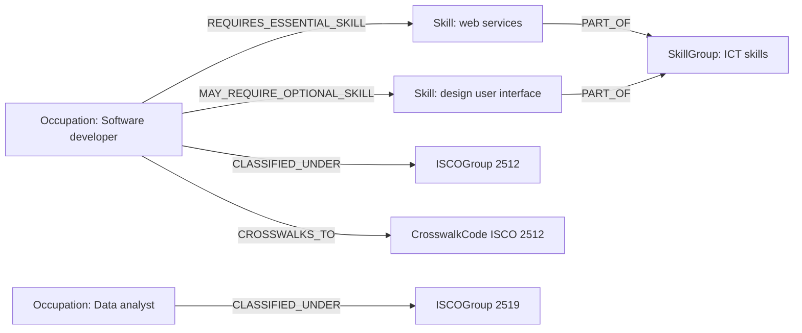

# Sprint 1 — Research & Build a Taxonomy Graph

> Homologation note (mentor follow-up): this folder was renamed
> `sprint-01_alexkantun` → `sprint-01` to match the common
> `mentees/<handle>/sprint-01/` layout, and the two importer bugs Alejandro
> had already diagnosed himself (a trailing-space `Occupation ` label and a
> `prefLabel_en2` property on `Skill`) are now **fixed in this homologation
> PR** — in `graph/model_ESCO_01/graph.cypher` and the Data Importer JSON.
> His original diagnosis is kept in
> `graph/model_occupations_example/ESCO_KG_Sample_From_Your_Script.cypher`
> because the failure mode is worth remembering. Top-level `graph.cypher`
> and `queries.cypher` were added in the standard format; everything else
> below is his original work.

## Which taxonomy

**ESCO** (European Skills, Competences, Qualifications and Occupations),
v1.2.1 (English).

## Where the data comes from (+ license)

- **Source:** ESCO Classification dataset, v1.2.1 (English) — <https://esco.ec.europa.eu/en/use-esco/download>
- **Publisher:** European Commission, DG Employment, Social Affairs and Inclusion
- **License:** ESCO is **free to use with attribution** under the ESCO/EU use
  conditions (see the [download page](https://esco.ec.europa.eu/en/use-esco/download));
  the dataset is published under Creative Commons Attribution 4.0
  International (CC BY 4.0) — https://creativecommons.org/licenses/by/4.0/
- **Attribution:** This work includes information from the ESCO
  classification, published by the European Commission. © European Union.
- **Format used:** CSV export (occupations, skills, ISCO groups, skill groups,
  and the occupation–skill / skill–skill relation files)

## Graph model

ESCO is already SKOS/RDF (`skos:Concept`, `skos:broader`, plus essential/optional skill predicates), so the property-graph translation is fairly direct:

| Node label | Key property | Represents |
|---|---|---|
| `Occupation` | `uri` | An ESCO occupation concept |
| `Skill` | `uri` | An ESCO skill/competence concept |
| `ISCOGroup` | `code` (string, to keep leading zeros) | ISCO-08 classification group |
| `SkillGroup` | `code` (string) | ESCO skill-hierarchy group |
| `CrosswalkCode` | `scheme` + `code` | Shared bridge node (`scheme: "ISCO"`) toward O\*NET/BLS via ISCO↔SOC |

| Relationship | Direction | Meaning |
|---|---|---|
| `REQUIRES_ESSENTIAL_SKILL` | `Occupation → Skill` | Skill is core to the occupation |
| `MAY_REQUIRE_OPTIONAL_SKILL` | `Occupation → Skill` | Skill is contextual/optional |
| `CLASSIFIED_UNDER` | `Occupation → ISCOGroup` | ISCO-08 mapping |
| `IS_BROADER_THAN` | `Group → Group` (Skill or ISCO) | Hierarchy edge |
| `CROSSWALKS_TO` | `Occupation → CrosswalkCode` | Attachment to the shared ISCO code |



Conventions (workspace-wide, for the future integrated graph):

- Every node carries `source: "esco"` and a `source_id` (the ESCO concept
  URI, or the deterministic `http://data.europa.eu/esco/isco/C<code>` URI for
  ISCO groups) — so nodes from different taxonomies can coexist without ID
  collisions.
- `code` fields are typed as **strings** to preserve ISCO-08 leading zeros.
- `CROSSWALKS_TO` edges point at shared `CrosswalkCode {scheme: "ISCO"}`
  nodes — ESCO's natural bridge, since ISCO↔SOC crosswalks connect the same
  codes to O\*NET and BLS.

[`graph.cypher`](graph.cypher) in this folder is a small, runnable slice that
builds exactly this shape; [`queries.cypher`](queries.cypher) holds the
example questions below. The real importer script and Data Importer model for
the **full** AuraDB build live under [`graph/`](graph/), documented in
[`README.md`](README.md).

## Example questions the graph answers

Each is a preview of one of the core TA agents; full Cypher in
[`queries.cypher`](queries.cypher).

1. **Locator** — *"I do frontend stuff — where am I in ESCO?"* Resolve messy
   input against `prefLabel`/`altLabels` and anchor the hit in the ISCO-08
   hierarchy.

2. **Connector** — *"What skills does occupation X require?"* (outgoing
   adjacency, split by ESCO's essential/optional distinction)
   ```cypher
   MATCH (o:Occupation {prefLabel_en: "data scientist"})-[r:REQUIRES_ESSENTIAL_SKILL|MAY_REQUIRE_OPTIONAL_SKILL]->(s:Skill)
   RETURN s.prefLabel_en, type(r) AS relationship;
   ```

3. **Connector (inverse)** — *"Which occupations share a given skill?"*
   ```cypher
   MATCH (s:Skill {prefLabel_en: "Python (computer programming)"})<-[:REQUIRES_ESSENTIAL_SKILL|MAY_REQUIRE_OPTIONAL_SKILL]-(o:Occupation)
   RETURN o.prefLabel_en;
   ```

4. **Pathfinder** — *"What connects 'web developer' to 'data scientist'?"*
   Shared skills form the bridge of a possible learning journey; the
   multi-hop variant uses `allShortestPaths` through skill-to-skill edges.

5. **Gap analysis (Evaluator preview)** — *"What must a web developer still
   learn to qualify as a data scientist?"* Only **essential** skills count as
   blockers — this is where ESCO's essential/optional distinction earns its
   keep as a poor man's edge weight.

6. **Crosswalk** — *"How is an occupation classified in ISCO-08, and which
   shared code bridges it toward O\*NET/BLS?"*
   ```cypher
   MATCH (o:Occupation)-[:CROSSWALKS_TO]->(x:CrosswalkCode {scheme: "ISCO"})
   RETURN o.prefLabel_en, x.code, x.name;
   ```

## What I learned & what's hard

**Theory**

- A knowledge graph earns its keep exactly where ESCO already lives: multi-hop questions ("what else needs this skill?", "what's the gap to occupation X?") that would otherwise need repeated joins.
- `MERGE` + uniqueness constraints make re-imports idempotent — important since ESCO ships periodic minor-version updates (this dataset is v1.2.1) that shouldn't duplicate the graph on re-run.
- In a property graph, the conceptual model and the physical model are the same artifact — there's no separate translation step between "what I sketched" and "what's queryable."

**Practice (ESCO-specific)**

- ESCO and O\*NET are *not* interchangeable — different structure, different keys, different license. Worth confirming the dataset before modeling, since the schemas don't transfer.
- `code` fields on `ISCOGroup`/`SkillGroup` need explicit **string** typing — ISCO-08 codes have leading zeros that get silently dropped if inferred as integers.
- ESCO's `skillSkillRelations` file reuses essential/optional semantics (not a symmetric "related to") — so the same two relationship types cover both occupation→skill and skill→skill edges; no extra relationship type was needed.
- `definition` is almost entirely empty on ESCO concepts — `description` is the populated, human-readable field to use instead.

**What's hard**

- Two importer bugs slipped through the Data Importer export — a
  trailing-space `Occupation ` label and a `prefLabel_en2` property on
  `Skill` — both silent: nothing errors, queries just quietly match nothing.
  Diagnosed during the sprint; **fixed in the homologation PR**.
- Node-count discrepancies vs. the published ESCO totals and a null
  `SkillGroup.code` mapping remain open — see the retrospective in
  [`README.md`](README.md).

## Reflection — what would the TA-agents need from this graph?


**Locator** — pinpoints a skill/task/occupation in the taxonomies.
- Needs a stable anchor it can resolve *to* from messy input (job titles, résumé text, free-form search). The ESCO `uri` is that anchor, but Locator can't search free text against a URI — it needs a full-text/fuzzy index over `prefLabel` and the split-out `altLabels` array (ESCO ships alt labels newline-delimited in a single cell; already handled here via `split()`).
- Benefits from `description` as a disambiguation field when multiple concepts share a near-identical label (e.g. "developer" matching several distinct occupations).

**Connector** — lists the nodes directly preceding/succeeding a location.
- Maps cleanly onto the single-hop edges already in this schema: `IS_BROADER_THAN` for hierarchy neighbors, `REQUIRES_ESSENTIAL_SKILL` / `MAY_REQUIRE_OPTIONAL_SKILL` for occupation↔skill adjacency in either direction.
- What's missing: "preceding/succeeding" implies one consistent notion of adjacency, but hierarchy edges and skill-requirement edges are semantically different kinds of steps. Connector would need to know which relationship types count as "neighbors" for a given query rather than treating every outgoing edge the same way.

**Pathfinder** — traces all routes between two locations (learning journeys).
- This is the multi-hop case (`allShortestPaths` / variable-length `MATCH`). The career-transition query already built for the Query deliverable (shared essential skills, Jaccard-normalized) is effectively a one-hop version of what Pathfinder needs generalized to N hops.
- What's hard: **the current graph has no edge weights.** ESCO's occupation–skill relation is a binary essential/optional flag — no numeric distance, cost, or difficulty on any edge. Pathfinder can confirm a route *exists*, but has no basis yet for preferring the easiest one over an alternative.
- The deferred `Qualification` pillar also limits Pathfinder today — a real learning journey usually ends at a qualification, not just another skill or occupation, and that pillar is still an empty placeholder in this build.

**Evaluator (future)** — ranks paths by relevance, distance, profile fit.
- Needs the most that isn't here yet: a numeric importance score per skill–occupation edge (O\*NET's IM/LV ratings are the closest analogue — ESCO has no equivalent, it's strictly essential/optional with no grading), a "distance" metric derived from path length or skill overlap (the Jaccard score already computed is a candidate building block), and some representation of a learner/candidate *profile* node to score "fit" against — none of which exists in the v1 schema.
- This is the clearest place where ESCO's structure diverges from O\*NET's: O\*NET bakes importance/level scores into every skill edge for free, which is exactly the kind of signal Evaluator wants. Building Evaluator on top of ESCO will likely mean deriving those weights rather than importing them.
