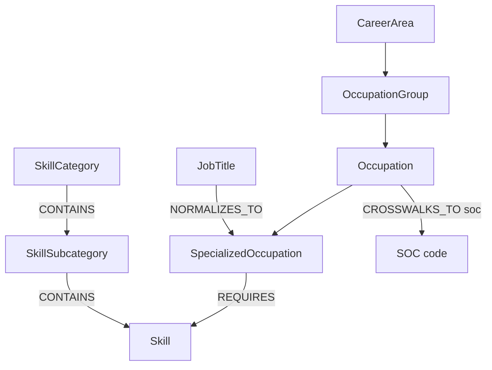

# Sprint 1 — Lightcast Knowledge Graph slice

> Mentor entry (nosoypoot). Lightcast was the one reference taxonomy left
> unassigned in Sprint 1 — this closes the set so all 5 taxonomies
> (ESCO, O\*NET, SFIA, BLS, Lightcast) have a first KG exploration.

## Which taxonomy

**Lightcast** (formerly Emsi Burning Glass). Unlike ESCO/O\*NET/SFIA/BLS,
Lightcast is a **commercial** labor-market data provider, but it publishes an
**open, freely usable core**: the **Lightcast Open Skills** library. That open
core is what this slice models, plus the occupation side (LOT) needed to
connect skills to jobs.

Lightcast is really **two taxonomies plus a normalization layer**:

1. **Open Skills** — 33,000+ standardized skills, updated regularly from
   millions of job postings and profiles.
   - Hierarchy: `Category → Subcategory → Skill` (e.g.
     *Information Technology → Artificial Intelligence → Machine Learning*).
   - Each skill has a stable **skill ID**, a **type**
     (`Specialized Skill`, `Common Skill` — i.e. transversal/soft —, or
     `Certification`), a description, and often a Wikipedia/authority link.
2. **LOT — Lightcast Occupation Taxonomy** — the occupation side.
   - Hierarchy: `Career Area → Occupation Group → Occupation →
     Specialized Occupation`.
   - Crosswalks to **SOC** (the BLS occupation codes), which is the natural
     bridge to O\*NET (O\*NET-SOC) and, transitively, to ESCO (via
     ISCO ↔ SOC crosswalks).
3. **Job Titles** — ~75,000 raw job titles normalized to specialized
   occupations (e.g. "ML Ninja" → *Machine Learning Engineer*). This is a
   *normalization layer*, not a hierarchy — but it is gold for a Locator agent,
   because it maps messy user language to canonical nodes.

## Where the data comes from (+ license)

- **Open Skills page & downloads:** <https://lightcast.io/open-skills>
- **API docs (Skills, Titles, Classification):**
  <https://docs.lightcast.io/apis/skills> — free tier with registration.
- **License:** Open Skills is free to use with attribution under the Lightcast
  Open Skills license (registration required for API keys); the full LOT/LMI
  datasets are commercial and delivered to clients via data shares
  (Snowflake/Databricks/BigQuery). This slice only models structure, with a
  small **hand-curated illustrative sample** — node IDs marked `demo:` are
  placeholders, not real Lightcast IDs. Replace them with real IDs from the
  Open Skills API before using this for anything beyond learning.

## Graph model

- Node labels: `CareerArea`, `OccupationGroup`, `Occupation`,
  `SpecializedOccupation`, `JobTitle`, `Skill`, `SkillSubcategory`,
  `SkillCategory`.
- Every node carries `source: "lightcast"` and a `source_id` — the habit I want
  us to keep for the integrated graph, so nodes from different taxonomies can
  coexist without ID collisions.
- `REQUIRES` edges carry a `significance` property (Lightcast reports skill
  significance/frequency per occupation) — a taste of *weighted* edges, which
  the future Evaluator agent will need.

See [`graph.cypher`](graph.cypher) for the build script and
[`queries.cypher`](queries.cypher) for the example questions.

## Example questions the graph answers

1. *Locator:* "Where does 'ML Ninja' live in the taxonomy?" — resolve a messy
   title to its specialized occupation and career area.
2. *Connector:* "What skills does a Machine Learning Engineer require, and
   which subcategory does each belong to?"
3. *Pathfinder:* "What connects 'Data Analyst' to 'Machine Learning Engineer'?"
   — shared skills form the bridge (a mini learning journey).

## What I learned / what's hard

- **Lightcast is postings-driven, not committee-driven.** ESCO/O\*NET/SFIA are
  curated frameworks; Lightcast's taxonomy is distilled from live job postings.
  Consequence: it's fresher (new skills appear fast) but noisier, and its
  hierarchy is shallower (3 levels vs ESCO's deep SKOS trees).
- **The titles layer is the killer feature for Locator.** None of the other 4
  taxonomies ship a 75k-entry mapping from messy real-world language to
  canonical nodes. Whatever stack we choose, we should keep an equivalent
  alias/label index for every taxonomy.
- **Crosswalks are the integration currency.** Lightcast doesn't try to be
  universal — it crosswalks to SOC and lets SOC/ISCO do the bridging. Our
  integrated graph should treat crosswalks as first-class edges, not as ETL
  merge logic.
- **Licensing is the real constraint.** Open Skills is usable; full LOT/LMI is
  paid. Any TA-agents feature that depends on Lightcast must degrade gracefully
  to the open subset.
