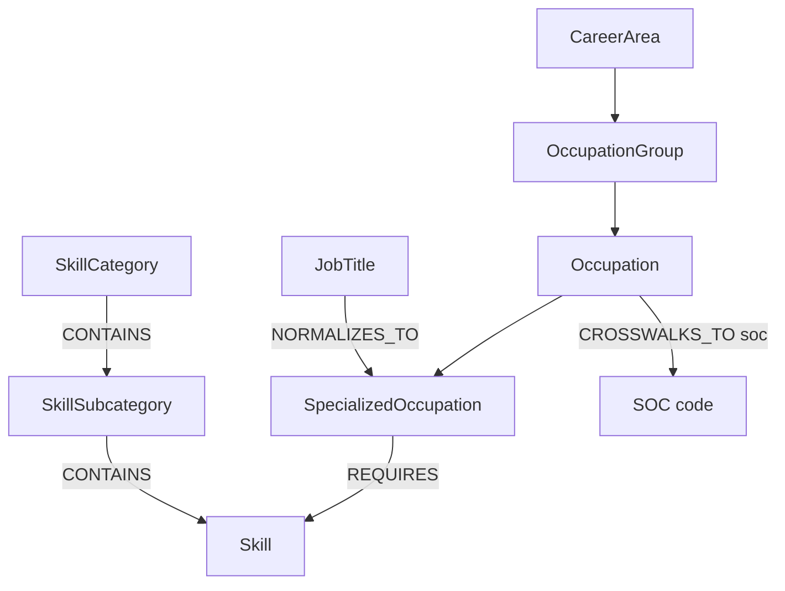

# Sprint 1 — Lightcast Knowledge Graph slice

> Mentor entry (nosoypoot). Lightcast was the one reference taxonomy left
> unassigned in Sprint 1 — this closes the set so all 5 taxonomies
> (ESCO, O\*NET, SFIA, BLS, Lightcast) have a first KG exploration.
>
> **Outcome: Lightcast is not adoptable.** What began as a taxonomy slice ended
> as the evidence for dropping it — see [Verdict](#verdict-lightcast-is-out).
> The graph below is kept because the *model* still teaches something: the
> job-title normalization layer is the best idea in the five taxonomies, and we
> should replicate it from open sources.

## Which taxonomy

**Lightcast** (formerly Emsi Burning Glass). Unlike ESCO/O\*NET/SFIA/BLS,
Lightcast is a **commercial** labor-market data provider. Its skills library is
published openly *as a taxonomy you can read*, which is what this slice models,
plus the occupation side (LOT) needed to connect skills to jobs.

Lightcast is really **two taxonomies plus a normalization layer**:

1. **Open Skills** — 34,000+ standardized skills, refreshed monthly from
   millions of job postings and profiles.
   - Hierarchy: `Category → Subcategory → Skill` (e.g.
     *Information Technology → Artificial Intelligence → Machine Learning*).
   - Each skill has a stable **skill ID**, a **type**
     (`Specialized Skill`, `Common Skill` — i.e. transversal/soft —, or
     `Certification`), a description, and often a Wikipedia/authority link.
2. **LOT — Lightcast Occupation Taxonomy** — the occupation side.
   - Hierarchy: `Career Area → Occupation Group → Occupation →
     Specialized Occupation`.
   - Crosswalks to **SOC** (the BLS occupation codes), which is the natural
     bridge to O\*NET (O\*NET-SOC) and, transitively, to ESCO (via
     ISCO ↔ SOC crosswalks).
3. **Job Titles** — ~75,000 raw job titles normalized to specialized
   occupations (e.g. "ML Ninja" → *Machine Learning Engineer*). This is a
   *normalization layer*, not a hierarchy — but it is gold for a Locator agent,
   because it maps messy user language to canonical nodes.

## Where the data comes from (+ license)

- **Taxonomy browser (free, no account):** <https://lightcast.io/open-skills> —
  the full skill list, categories, and descriptions are publicly viewable.
- **Skills Extractor (free tool):** normalizes skills out of a document (CV, job
  description) against the taxonomy — usable without an API contract.
- **Changelog:** public; the taxonomy updates monthly.
- **API docs:** <https://docs.lightcast.dev/apis/skills>

> ⚠️ **Finding — the free API tier is gone.** Lightcast's own FAQ now states
> that *"API access is now available on a contract basis"*, and the former
> `docs.lightcast.io/lightcast-api/docs/free-api-access` page returns 404.
> Verified 2026-07-19. Nonprofit / public-good organizations can request full
> access free of charge on registration, which is the route that applies to us
> as an LF Decentralized Trust project — but it is a **request, not a signup**.

**What this means for the project.** Of our five reference taxonomies, Lightcast
is now the most access-restricted for *programmatic* use: O\*NET (CC BY 4.0) and
BLS (US public domain) are fully open, ESCO is free with attribution, SFIA is
license-gated for organizations but published as readable documents — Lightcast
is the only one where the machine-readable path requires a contract. Two
consequences:

1. Any TA-agents feature depending on Lightcast must **degrade gracefully** when
   the connector is absent; it cannot sit on the critical path of a core agent.
2. We should **apply for nonprofit access** under the LFDT umbrella. Until that
   lands, Lightcast contributes *structure and concepts* to our model, not data.

Note on definitions: skill descriptions sourced from Wikipedia are distributed
under CC BY-SA — relevant if we ever ingest them.

**This slice therefore models structure only**, with a small hand-curated
illustrative sample. Node IDs marked `demo:` are placeholders, **not** real
Lightcast IDs — which is also why this folder carries no licensing exposure.

## Verdict: Lightcast is out

Researched 2026-07-19. **Recommendation: do not adopt Lightcast as a data
source.** Three independent reasons, any one of which would be sufficient.

**1. Price.** Lightcast publishes no pricing, but signed public contracts
bracket it:

| Amount | What it covers | Buyer | Year |
| --- | --- | --- | --- |
| $124,000 / 3 yr (~$41k/yr) | Developer licence, 3 seats + bulk data download | US International Trade Commission | 2024–27 |
| $50,000 / yr | Developer subscription, 12 users | CareerSource Florida | 2020–21 |
| $105,000 / yr | Labor market data | NSF | 2024–25 |

A published 2022 rate card shows their *Analyst/Community* GUI product at
$5,000–$12,000/yr — do not confuse the two. Programmatic access, the only kind
useful to us, runs 5–10× that. Out of reach for a volunteer mentorship project.

**2. Licence — the harder blocker.** The [Open Terms of Use](https://lightcast.io/open-terms-of-use)
permit redistribution and derivative works *"excluding commercial or for-profit
purposes"*, and §2.3 adds that *"commercial, for-profit, **and/or artificial
intelligence purposes** may be permitted provided the user contacts Lightcast
and enters into an agreement."* Our project is AI agents over taxonomies — that
clause names our exact use case. And our repos are Apache-2.0, which grants
readers commercial rights we would not hold. The November 2023 terms allowed
commercial use via a *"no-cost contract"*; the July 2025 revision dropped
"no-cost". The direction of travel is clear.

**3. Reliability.** The free API tier ended 2026-02-13 with three days' notice,
explicitly hitting open-source projects that depended on it. §5 reserves the
right to cancel access *"at any time, for any reason."* A core agent cannot sit
on that foundation.

*The nonprofit path is real but not a plan:* Lightcast offers free access to
nonprofits supporting a public good, which LFDT plausibly qualifies for — but
with no published criteria, no dedicated application, and no documented case of
it being granted to an open-source project. Worth requesting; not worth
planning around.

## What replaces it

Lightcast contributed three things the other taxonomies lack. Verified against
primary sources:

| Lightcast capability | Open substitute | Verdict |
| --- | --- | --- |
| Job-title normalization (~75k titles) | **O\*NET Job Titles** — 57,543 lay titles → O\*NET-SOC, CC BY 4.0; plus **ESCO altLabels** (28 languages, which Lightcast never had); plus **JobBERT-v3** (MIT) for semantic matching of titles never seen before | **Covered, arguably better** |
| Skill significance weights | **O\*NET Essential + Transferable Skills** — 62,580 weighted edges on Importance *and* Level scales, each with sample size, standard error and 95% CI; ships as native RDF | **Covered, more rigorous** |
| Monthly freshness from live postings | **Sweden JobTech** — ~6.9M job ads since 2006, **CC0**, live API, taxonomy already carrying `esco-occupation`/`esco-skill` concepts | **Covered at one country's scale**; no open global equivalent exists |

Note for the Evaluator: **ESCO is structurally binary** — 126,051 skill edges
across exactly two predicates (`hasEssentialSkill` / `hasOptionalSkill`), with
no field to hold a number. Any weighting on ESCO will be *our* modelling
decision and must be recorded as such, not presented as source data.

**Which taxonomy takes the fifth slot is a project decision, not a sprint
note** — see the data-sources ADR in `TA-workspace/docs/decisions/`. The two
candidates are Sweden JobTech (open, live, CC0) and the UK **Standard Skills
Classification** (OGL v3.0, published 2026-04-30), which ships crosswalks to
ESCO, O\*NET and SFIA in one package — though its skill weights are
LLM-generated with a documented reproducibility failure, so adopt its
crosswalks and distrust its scores.

## Graph model

- Node labels: `CareerArea`, `OccupationGroup`, `Occupation`,
  `SpecializedOccupation`, `JobTitle`, `Skill`, `SkillSubcategory`,
  `SkillCategory`.
- Every node carries `source: "lightcast"` and a `source_id` — the habit I want
  us to keep for the integrated graph, so nodes from different taxonomies can
  coexist without ID collisions.
- `REQUIRES` edges carry a `significance` property (Lightcast reports skill
  significance/frequency per occupation) — a taste of *weighted* edges, which
  the future Evaluator agent will need.

See [`graph.cypher`](graph.cypher) for the build script and
[`queries.cypher`](queries.cypher) for the example questions.

## Example questions the graph answers

1. *Locator:* "Where does 'ML Ninja' live in the taxonomy?" — resolve a messy
   title to its specialized occupation and career area.
2. *Connector:* "What skills does a Machine Learning Engineer require, and
   which subcategory does each belong to?"
3. *Connector (inverse):* "Which occupations ask for SQL?"
4. *Pathfinder:* "What connects 'Data Analyst' to 'Machine Learning Engineer'?"
   — shared skills form the bridge (a mini learning journey).
5. *Evaluator preview:* "What is a Data Analyst missing to become an MLE?" —
   gap analysis ranked by skill significance.
6. *Crosswalk:* "How does this occupation map to SOC?" — the bridge to BLS and,
   through it, to O\*NET.

## What I learned / what's hard

- **Lightcast is postings-driven, not committee-driven.** ESCO/O\*NET/SFIA are
  curated frameworks; Lightcast's taxonomy is distilled from live job postings.
  Consequence: it's fresher (new skills appear fast) but noisier, and its
  hierarchy is shallower (3 levels vs ESCO's deep SKOS trees).
- **The titles layer is the killer feature for Locator.** None of the other 4
  taxonomies ship a 75k-entry mapping from messy real-world language to
  canonical nodes. Whatever stack we choose, we should keep an equivalent
  alias/label index for every taxonomy.
- **Crosswalks are the integration currency.** Lightcast doesn't try to be
  universal — it crosswalks to SOC and lets SOC/ISCO do the bridging. Our
  integrated graph should treat crosswalks as first-class edges, not as ETL
  merge logic.
- **Licensing is the real constraint, and it moved.** The free API tier existed
  when this sprint was briefed and no longer does. Access terms are part of a
  taxonomy's design surface, not a footnote — they belong in the integration
  document and need a re-check date, not a one-time note.
