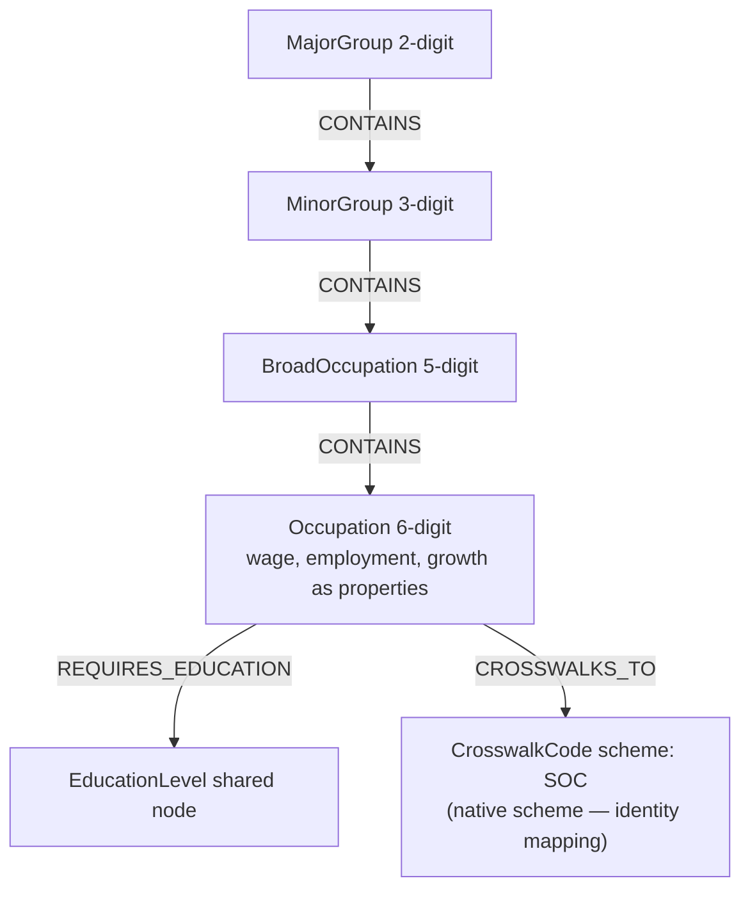

# Sprint 1 — BLS Knowledge Graph (Employment Projections 2024–34)

> Compact, common-format summary of this sprint's work. The full research
> write-up — the SOC hierarchy explained digit by digit, the 2024–34
> projection-cycle findings, and the cross-taxonomy comparison — lives in
> [`README.md`](README.md), which remains the deep-dive document.

## Which taxonomy

**BLS / SOC** — the U.S. Bureau of Labor Statistics' Employment Projections,
keyed by the federal **Standard Occupational Classification (SOC)**. It is an
*employment-centric* taxonomy: for every occupation in the U.S. economy it
publishes employment counts (2024 base, 2034 projected), percent change,
median annual wage, and typical entry education.

The 6-digit SOC code encodes a four-level hierarchy:

```
Major Group   (2-digit)  →  23 groups         e.g. 15-0000 Computer & Mathematical
Minor Group   (3-digit)  →  98 groups         e.g. 15-2000 Mathematical Science
Broad Occ.    (5-digit)  →  459 groups        e.g. 15-2050 Data Scientists
Detailed Occ. (6-digit)  →  867 occupations   e.g. 15-2051 Data Scientists
```

BLS has **no skills or tasks layer** — that richness lives in O\*NET, ESCO,
SFIA, and Lightcast. What BLS uniquely contributes is *economic signal*
(growth, wages, education entry) and the **SOC code itself**, the universal
join key the other taxonomies crosswalk into.

## Where the data comes from (+ license)

- **BLS Employment Projections program:** <https://www.bls.gov/emp/> —
  Table 1.2 of `Occupation.xlsx`, 2024–34 cycle (832 published line-item
  occupations after filtering summary rows).
- **License:** work of the U.S. federal government — **public domain**. Free
  to use and redistribute; cite BLS as the source.
- Ingested with a pandas ETL (`data_loader.py`) into **Neo4j Aura** via the
  official Python driver (`database.py`, `graph_builder.py`, `main.py`). The
  raw `.xlsx` is not committed — download it from bls.gov into `data/`.

## Graph model



Conventions:

- Every node carries `source: "bls"` and a `source_id` (the SOC code; for
  `EducationLevel`, the level label) so BLS nodes can coexist with other
  taxonomies in the integrated graph without ID collisions.
- **Scalar per-occupation facts are properties, not nodes.** Median wage,
  base/projected employment, and percent change live directly on
  `Occupation`. The first version modeled them as satellite nodes MERGE-d by
  value, which silently fused unrelated occupations that shared a
  coincidental number — the sprint's most valuable modeling lesson.
- `EducationLevel` stays a **shared node**: many occupations genuinely point
  at the same entry credential, so it has identity of its own.
- The **SOC hierarchy is derived programmatically** from the 6-digit code
  (exactly as the README documents digit by digit) and materialized as
  `MajorGroup -[:CONTAINS]-> MinorGroup -[:CONTAINS]-> BroadOccupation
  -[:CONTAINS]-> Occupation`.
- `CROSSWALKS_TO` edges point at `CrosswalkCode {scheme: "SOC"}` nodes. For
  BLS this is the *identity* crosswalk — SOC is its native scheme — which
  makes BLS the hub that Lightcast (LOT→SOC), O\*NET (O\*NET-SOC), and ESCO
  (via ISCO↔SOC) all land on.

See [`graph.cypher`](graph.cypher) for a standalone illustrative slice and
[`queries.cypher`](queries.cypher) for the example questions.

## Example questions the graph answers

1. *Locator:* "Where does Data Scientists (15-2051) live in the SOC tree?" —
   resolve an occupation and walk its Major → Minor → Broad path.
2. *Locator:* "Which growing occupations require only a Bachelor's degree?" —
   education, growth, and wage filters in one traversal.
3. *Connector:* "What sits directly under minor group 29-1000?" (downstream)
   and "which broad/minor/major group contains Registered nurses?" (upstream).
4. *Connector:* "Which occupations share Registered nurses' entry education?"
   — the shared `EducationLevel` node is the connector.
5. *Pathfinder (scoped):* BLS has no skills, so shared-skill bridges are out
   of scope for this taxonomy. Its Pathfinder contribution is the SOC
   crosswalk (join paths found in skill-rich taxonomies) plus economic
   signals to rank them; the nearest in-graph analogue is an education-level
   bridge (e.g. Registered nurse → Nurse practitioner).
6. *Evaluator preview:* "Is the move worth it?" — wage delta and growth delta
   between a current and a target occupation.

## What I learned & what's hard

- **Value-MERGE is a modeling trap.** Scalar facts of a single entity belong
  as properties of that entity's node; nodes are for things with identity
  that multiple entities genuinely share (like an education level). Two
  occupations with the same median wage must *not* share a `WageData` node.
- **NULL proliferation.** BLS uses `—` for suppressed values; the ETL maps
  them to `None` so properties are simply absent rather than fake-valued.
- **The hierarchy is in the code, not the rows.** Table 1.2 line items are
  6-digit occupations only; the tree must be derived from the digits. A few
  2018 SOC minor groups break the third-digit rule (e.g. Computer
  Occupations is 15-1200), so derived group codes are structural
  approximations — ingesting the summary rows would recover official group
  titles (v2).
- **No skills layer.** BLS tells you *what jobs exist, how many, at what
  wage* — not what tasks or skills they involve. Enrichment from O\*NET /
  ESCO / Lightcast, joined on SOC codes, is required before skill-gap
  questions are answerable.
- **Temporal snapshot, not time series.** One projection cycle (2024–34);
  ingesting successive cycles would enable trend analysis.
